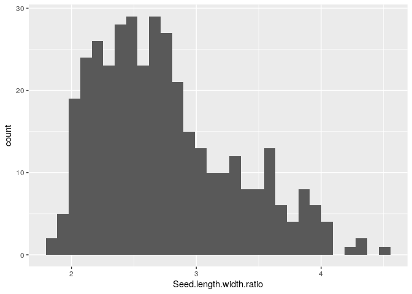
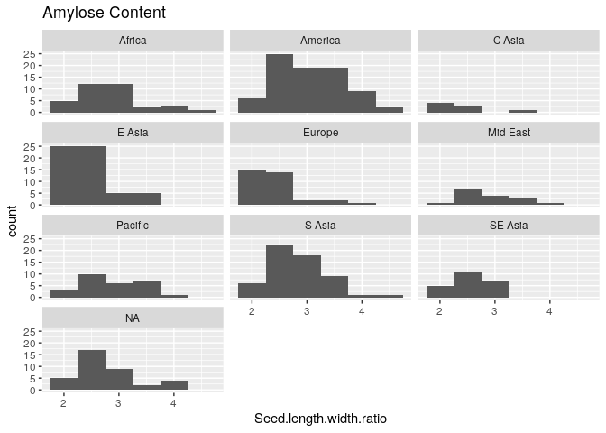
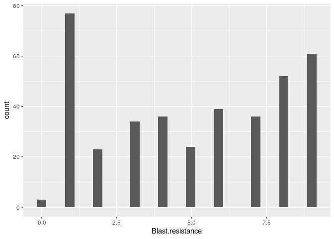
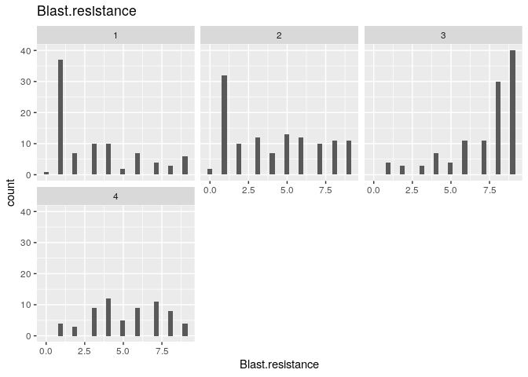
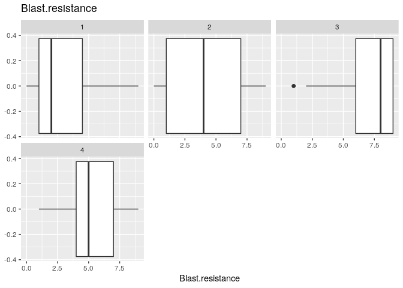

__Name:__ Zun Wang

__Student ID:__ 915109847


## Assignment 4: Rice SNPs and GWAS

Remember to include the relevant code from the lab page in this file so that this file will knit.

**Exercise 0:** Be sure that your final knitted file has good formatting.  Make sure that you are using informative variable names.---
title: "Rice GWAS"
layout: lab
tags:
- R
- SNPs
hidden: true
---


```r
library(tidyverse)
```

```
## ── Attaching packages ─────────────────────────────────────── tidyverse 1.3.0 ──
```

```
## ✓ ggplot2 3.3.0     ✓ purrr   0.3.3
## ✓ tibble  2.1.3     ✓ dplyr   0.8.5
## ✓ tidyr   1.0.2     ✓ stringr 1.4.0
## ✓ readr   1.3.1     ✓ forcats 0.5.0
```

```
## ── Conflicts ────────────────────────────────────────── tidyverse_conflicts() ──
## x dplyr::filter() masks stats::filter()
## x dplyr::lag()    masks stats::lag()
```

```r
load("../output/data_from_SNP_lab.Rdata")
```

```r
pheno.geno.pca.pop <- left_join(geno.pca.pop, data.pheno, by=c("ID" = "NSFTVID"))

#get rid of spaces in the phenotype names with "make.names()"
colnames(pheno.geno.pca.pop) <- make.names(colnames(pheno.geno.pca.pop))

head(pheno.geno.pca.pop)
```

<div data-pagedtable="false">
  <script data-pagedtable-source type="application/json">
{"columns":[{"label":["ID"],"name":[1],"type":["chr"],"align":["left"]},{"label":["PC1"],"name":[2],"type":["dbl"],"align":["right"]},{"label":["PC2"],"name":[3],"type":["dbl"],"align":["right"]},{"label":["PC3"],"name":[4],"type":["dbl"],"align":["right"]},{"label":["PC4"],"name":[5],"type":["dbl"],"align":["right"]},{"label":["PC5"],"name":[6],"type":["dbl"],"align":["right"]},{"label":["PC6"],"name":[7],"type":["dbl"],"align":["right"]},{"label":["PC7"],"name":[8],"type":["dbl"],"align":["right"]},{"label":["PC8"],"name":[9],"type":["dbl"],"align":["right"]},{"label":["PC9"],"name":[10],"type":["dbl"],"align":["right"]},{"label":["PC10"],"name":[11],"type":["dbl"],"align":["right"]},{"label":["pop1"],"name":[12],"type":["dbl"],"align":["right"]},{"label":["pop2"],"name":[13],"type":["dbl"],"align":["right"]},{"label":["pop3"],"name":[14],"type":["dbl"],"align":["right"]},{"label":["pop4"],"name":[15],"type":["dbl"],"align":["right"]},{"label":["assignedPop"],"name":[16],"type":["chr"],"align":["left"]},{"label":["maxPr"],"name":[17],"type":["dbl"],"align":["right"]},{"label":["plot.order"],"name":[18],"type":["int"],"align":["right"]},{"label":["Accession_Name"],"name":[19],"type":["chr"],"align":["left"]},{"label":["Country_of_Origin"],"name":[20],"type":["chr"],"align":["left"]},{"label":["Region"],"name":[21],"type":["chr"],"align":["left"]},{"label":["Alu.Tol"],"name":[22],"type":["dbl"],"align":["right"]},{"label":["Flowering.time.at.Arkansas"],"name":[23],"type":["dbl"],"align":["right"]},{"label":["Flowering.time.at.Faridpur"],"name":[24],"type":["dbl"],"align":["right"]},{"label":["Flowering.time.at.Aberdeen"],"name":[25],"type":["dbl"],"align":["right"]},{"label":["FT.ratio.of.Arkansas.Aberdeen"],"name":[26],"type":["dbl"],"align":["right"]},{"label":["FT.ratio.of.Faridpur.Aberdeen"],"name":[27],"type":["dbl"],"align":["right"]},{"label":["Culm.habit"],"name":[28],"type":["dbl"],"align":["right"]},{"label":["Leaf.pubescence"],"name":[29],"type":["dbl"],"align":["right"]},{"label":["Flag.leaf.length"],"name":[30],"type":["dbl"],"align":["right"]},{"label":["Flag.leaf.width"],"name":[31],"type":["dbl"],"align":["right"]},{"label":["Awn.presence"],"name":[32],"type":["dbl"],"align":["right"]},{"label":["Panicle.number.per.plant"],"name":[33],"type":["dbl"],"align":["right"]},{"label":["Plant.height"],"name":[34],"type":["dbl"],"align":["right"]},{"label":["Panicle.length"],"name":[35],"type":["dbl"],"align":["right"]},{"label":["Primary.panicle.branch.number"],"name":[36],"type":["dbl"],"align":["right"]},{"label":["Seed.number.per.panicle"],"name":[37],"type":["dbl"],"align":["right"]},{"label":["Florets.per.panicle"],"name":[38],"type":["dbl"],"align":["right"]},{"label":["Panicle.fertility"],"name":[39],"type":["dbl"],"align":["right"]},{"label":["Seed.length"],"name":[40],"type":["dbl"],"align":["right"]},{"label":["Seed.width"],"name":[41],"type":["dbl"],"align":["right"]},{"label":["Seed.volume"],"name":[42],"type":["dbl"],"align":["right"]},{"label":["Seed.surface.area"],"name":[43],"type":["dbl"],"align":["right"]},{"label":["Brown.rice.seed.length"],"name":[44],"type":["dbl"],"align":["right"]},{"label":["Brown.rice.seed.width"],"name":[45],"type":["dbl"],"align":["right"]},{"label":["Brown.rice.surface.area"],"name":[46],"type":["dbl"],"align":["right"]},{"label":["Brown.rice.volume"],"name":[47],"type":["dbl"],"align":["right"]},{"label":["Seed.length.width.ratio"],"name":[48],"type":["dbl"],"align":["right"]},{"label":["Brown.rice.length.width.ratio"],"name":[49],"type":["dbl"],"align":["right"]},{"label":["Seed.color"],"name":[50],"type":["chr"],"align":["left"]},{"label":["Pericarp.color"],"name":[51],"type":["chr"],"align":["left"]},{"label":["Straighthead.suseptability"],"name":[52],"type":["dbl"],"align":["right"]},{"label":["Blast.resistance"],"name":[53],"type":["dbl"],"align":["right"]},{"label":["Amylose.content"],"name":[54],"type":["dbl"],"align":["right"]},{"label":["Alkali.spreading.value"],"name":[55],"type":["dbl"],"align":["right"]},{"label":["Protein.content"],"name":[56],"type":["dbl"],"align":["right"]}],"data":[{"1":"NSFTV1","2":"-31.968928","3":"-6.773336","4":"19.284001","5":"-1.0843823","6":"0.84151681","7":"-0.008595773","8":"0.1816306","9":"-1.0413577","10":"0.18724510","11":"-1.757475","12":"0.000013","13":"0.000013","14":"0.999960","15":"0.000013","16":"3","17":"0.999960","18":"251","19":"Agostano","20":"Italy","21":"Europe","22":"0.73","23":"75.08333","24":"64","25":"81","26":"0.9269547","27":"0.7901235","28":"4.0","29":"1","30":"28.37500","31":"1.2833333","32":"0","33":"3.068053","34":"110.9167","35":"20.48182","36":"9.272727","37":"4.785975","38":"4.914658","39":"0.879","40":"8.064117","41":"3.685183","42":"2.587448","43":"3.914120","44":"5.794542","45":"3.113958","46":"3.511152","47":"7.737358","48":"2.188","49":"1.861","50":"light","51":"light","52":"4.833333","53":"8","54":"15.61333","55":"6.083333","56":"8.45"},{"1":"NSFTV3","2":"47.011369","3":"17.885011","4":"8.075724","5":"0.7796337","6":"-3.34617048","7":"13.799389943","8":"-4.7681734","9":"0.1213285","10":"-2.69514468","11":"-1.993345","12":"0.999959","13":"0.000014","14":"0.000014","15":"0.000013","16":"1","17":"0.999959","18":"8","19":"Ai-Chiao-Hong","20":"China","21":"E Asia","22":"0.30","23":"89.50000","24":"66","25":"83","26":"1.0783133","27":"0.7951807","28":"7.5","29":"0","30":"39.00833","31":"1.0000000","32":"0","33":"4.051785","34":"143.5000","35":"26.83333","36":"9.166667","37":"4.439706","38":"4.727388","39":"0.750","40":"7.705383","41":"2.951458","42":"2.111145","43":"3.658709","44":"5.603658","45":"2.566450","46":"3.287373","47":"5.105350","48":"2.611","49":"2.183","50":"light","51":"light","52":"7.831667","53":"4","54":"23.26000","55":"5.638889","56":"9.20"},{"1":"NSFTV4","2":"35.865351","3":"-20.891238","4":"-8.009400","5":"-6.4513608","6":"0.99284666","7":"4.968721211","8":"13.8698903","9":"6.8019713","10":"13.98276325","11":"-5.063145","12":"0.102714","13":"0.000013","14":"0.000013","15":"0.897259","16":"4","17":"0.897259","18":"398","19":"NSF-TV 4","20":"Unknown","21":"NA","22":"0.54","23":"94.50000","24":"67","25":"93","26":"1.0161290","27":"0.7204301","28":"6.0","29":"1","30":"27.68333","31":"1.5166667","32":"0","33":"3.124565","34":"128.0833","35":"23.53333","36":"8.666667","37":"5.079709","38":"5.146437","39":"0.935","40":"8.237575","41":"2.926367","42":"2.154759","43":"3.713856","44":"6.120342","45":"2.466983","46":"3.334126","47":"5.126958","48":"2.815","49":"2.481","50":"light","51":"light","52":"NA","53":"3","54":"23.12000","55":"5.527778","56":"8.00"},{"1":"NSFTV5","2":"-5.568475","3":"-7.450594","4":"-4.637975","5":"40.4054200","6":"-2.14945234","7":"-1.073944548","8":"1.0622925","9":"4.6625462","10":"0.07144979","11":"1.168687","12":"0.000014","13":"0.403064","14":"0.269806","15":"0.327115","16":"2","17":"0.403064","18":"226","19":"NSF-TV 5","20":"Unknown","21":"NA","22":"0.44","23":"87.50000","24":"70","25":"108","26":"0.8101852","27":"0.6481481","28":"3.5","29":"1","30":"30.41667","31":"0.8916667","32":"0","33":"3.697178","34":"153.7500","35":"28.96364","36":"6.363636","37":"4.523960","38":"4.730921","39":"0.813","40":"9.709375","41":"2.382100","42":"1.940221","43":"3.700054","44":"7.089883","45":"2.044608","46":"3.297792","47":"4.085133","48":"4.076","49":"3.468","50":"light","51":"light","52":"8.333333","53":"5","54":"19.32333","55":"6.027778","56":"9.60"},{"1":"NSFTV6","2":"34.138704","3":"-20.524952","4":"-7.958786","5":"-6.3324348","6":"2.08317305","7":"5.531640379","8":"15.7992531","9":"8.0417879","10":"15.82829137","11":"-5.303237","12":"0.091912","13":"0.011408","14":"0.000014","15":"0.896667","16":"4","17":"0.896667","18":"399","19":"ARC 7229","20":"India","21":"S Asia","22":"0.57","23":"89.08333","24":"73","25":"101","26":"0.8820132","27":"0.7227723","28":"6.0","29":"1","30":"36.90833","31":"1.7500000","32":"0","33":"2.857428","34":"148.3333","35":"30.91667","36":"11.166667","37":"5.538646","38":"5.676468","39":"0.871","40":"7.118183","41":"3.281892","42":"2.202360","43":"3.657370","44":"5.136483","45":"2.803858","46":"3.284328","47":"5.555183","48":"2.169","49":"1.832","50":"light","51":"light","52":"8.166667","53":"3","54":"23.24000","55":"5.444444","56":"8.50"},{"1":"NSFTV7","2":"-19.490962","3":"6.324921","4":"-17.189141","5":"-1.5574399","6":"-0.00198229","7":"1.012339294","8":"0.8563215","9":"0.3680201","10":"0.88101833","11":"2.298343","12":"0.000013","13":"0.941008","14":"0.017106","15":"0.041873","16":"2","17":"0.941008","18":"171","19":"Arias","20":"Indonesia","21":"Pacific","22":"0.86","23":"105.00000","24":"NA","25":"158","26":"0.6645570","27":"NA","28":"3.0","29":"1","30":"36.99000","31":"1.5500000","32":"1","33":"2.859021","34":"119.6000","35":"24.62500","36":"13.333333","37":"5.338019","38":"5.435903","39":"0.907","40":"7.347255","41":"2.528891","42":"1.774465","43":"3.474791","44":"5.485345","45":"2.188882","46":"3.101569","47":"3.591045","48":"2.905","49":"2.506","50":"light","51":"light","52":"8.585000","53":"2","54":"20.18667","55":"6.000000","56":"11.75"}],"options":{"columns":{"min":{},"max":[10]},"rows":{"min":[10],"max":[10]},"pages":{}}}
  </script>
</div>

```r
dim(pheno.geno.pca.pop)
```

```
## [1] 413  56
```


```r
library(ggplot2)
pheno.geno.pca.pop %>%
  ggplot(aes(x=`Seed.length.width.ratio`)) +
  geom_histogram()
```

```
## `stat_bin()` using `bins = 30`. Pick better value with `binwidth`.
```

```
## Warning: Removed 36 rows containing non-finite values (stat_bin).
```

<!-- -->

```r
pl <- ggplot(data=pheno.geno.pca.pop, aes(x=Seed.length.width.ratio)) #create the basic plot object
pl <- pl + geom_histogram(binwidth=.5) #tell R that we want a histogram, with binwidth of .5
pl <- pl + facet_wrap(facets= ~ Region, ncol=3) # a separate plot ("facet") for each region, arranged in 3 columns
pl <- pl + ggtitle("Amylose Content") #add a title
pl #display the plot
```

```
## Warning: Removed 36 rows containing non-finite values (stat_bin).
```

<!-- -->

**Exercise 7:** What Trait did you choose?

* Plot your chosen trait data
  * as a **single histogram** for all of the data
  * as **separate histograms** for each of the 4 population assignments made by fastStructure
  * as a **boxplot** separated by population assignments made by fastStructure. 
* Based on these histograms do you think that your trait varies by population? 
* **optional** Try using the "violin" geom.  
  
*Hint:* you will need to use a different binwidth than I used with Seed.length.width (or don't specify it at all and let R choose the default).

*Hint:* the relevant column name for population is "assignedPop".  

```r
pheno.geno.pca.pop %>%
  ggplot(aes(x=`Blast.resistance`)) +
  geom_histogram()
```

```
## `stat_bin()` using `bins = 30`. Pick better value with `binwidth`.
```

```
## Warning: Removed 28 rows containing non-finite values (stat_bin).
```

<!-- -->


```r
bl <- ggplot(data=pheno.geno.pca.pop, aes(x=`Blast.resistance`)) #create the basic plot object
bl <- bl + geom_histogram() #tell R that we want a histogram, with binwidth of .5
bl <- bl + facet_wrap(facets= ~ assignedPop, ncol=3) # a separate plot ("facet") for each region, arranged in 3 columns
bl <- bl + ggtitle("Blast.resistance") #add a title
bl #display the plot
```

```
## `stat_bin()` using `bins = 30`. Pick better value with `binwidth`.
```

```
## Warning: Removed 28 rows containing non-finite values (stat_bin).
```

<!-- -->

```r
bl2 <- ggplot(data=pheno.geno.pca.pop, aes(x=`Blast.resistance`)) #create the basic plot object
bl2 <- bl2 + geom_boxplot() #tell R that we want a histogram, with binwidth of .5
bl2 <- bl2 + facet_wrap(facets= ~ assignedPop, ncol=3) # a separate plot ("facet") for each region, arranged in 3 columns
bl2 <- bl2 + ggtitle("Blast.resistance") #add a title
bl2 #display the plot
```

```
## Warning: Removed 28 rows containing non-finite values (stat_boxplot).
```

<!-- -->

```r
#The difference is big and is potentially significant.
```

**Exercise 8:** 

* Obtain the mean of your trait for each of the four fastStructure populations.
* Perform an ANOVA for your trait to test if it varies significantly by fastStructure population.  Show your code, the ANOVA output, and provide an interpretation.
* Discuss: Do your results suggest a problem for GWAS?

```r
sem <- function(x, na.rm=TRUE) {
  if(na.rm) x <- na.omit(x)
  sd(x)/sqrt(length(x)-1)
}

pheno.geno.pca.pop %>% group_by(assignedPop) %>% 
  summarize(mean.bl=mean(Blast.resistance,na.rm=T),
            sem.bl=sem(Blast.resistance)
            ) %>%
  arrange(desc(mean.bl))
```

<div data-pagedtable="false">
  <script data-pagedtable-source type="application/json">
{"columns":[{"label":["assignedPop"],"name":[1],"type":["chr"],"align":["left"]},{"label":["mean.bl"],"name":[2],"type":["dbl"],"align":["right"]},{"label":["sem.bl"],"name":[3],"type":["dbl"],"align":["right"]}],"data":[{"1":"3","2":"7.168142","3":"0.2082110"},{"1":"4","2":"5.246154","3":"0.2812767"},{"1":"2","2":"4.250000","3":"0.2612486"},{"1":"1","2":"3.206897","3":"0.2839391"}],"options":{"columns":{"min":{},"max":[10]},"rows":{"min":[10],"max":[10]},"pages":{}}}
  </script>
</div>

```r
aov2 <- aov(Blast.resistance ~ assignedPop,data=pheno.geno.pca.pop) #1-way ANOVA for Amylose.content by Region
summary(aov2)
```

```
##              Df Sum Sq Mean Sq F value Pr(>F)    
## assignedPop   3  881.8  293.92   46.07 <2e-16 ***
## Residuals   381 2430.6    6.38                   
## ---
## Signif. codes:  0 '***' 0.001 '**' 0.01 '*' 0.05 '.' 0.1 ' ' 1
## 28 observations deleted due to missingness
```

```r
#The blast resistance difference among populations are significant, so blast resistance is different among each population, and thus is problem for GWAS.
```

**Exercise 9:** Complete the code below to generate a GM object like the one above.  Note that "chr" and "pos" should be numeric.  _Hint:_ Look at help for the `separate` command.  You will need to specify the `into`, `sep`, `convert` and `remove` arguments.

```r
if (!requireNamespace("BiocManager", quietly = TRUE))
    install.packages("BiocManager")
BiocManager::install("multtest")
```

```
## Bioconductor version 3.10 (BiocManager 1.30.10), R 3.6.3 (2020-02-29)
```

```
## Installing package(s) 'multtest'
```

```
## Installation path not writeable, unable to update packages: boot, class,
##   KernSmooth, lattice, MASS, nlme, nnet, spatial, survival
```

```
## Old packages: 'broom', 'dbplyr', 'DelayedArray', 'devtools', 'foghorn',
##   'gdtools', 'GenomeInfoDb', 'igraph', 'isoband', 'locfit', 'lubridate',
##   'modelr', 'multcomp', 'pkgbuild', 'pkgdown', 'purrr', 'quantreg', 'Rcpp',
##   'RCurl', 'rematch2', 'reshape2', 'reticulate', 'rex', 'rgl', 'S4Vectors',
##   'sass', 'sf', 'systemfonts', 'tibble', 'tinytex', 'usethis', 'withr', 'xfun',
##   'xml2'
```

```r
install.packages("EMMREML")
```

```
## Installing package into '/home/ubuntu/R/x86_64-pc-linux-gnu-library/3.6'
## (as 'lib' is unspecified)
```

```r
devtools::install_github("jiabowang/GAPIT3",force=TRUE)
```

```
## Downloading GitHub repo jiabowang/GAPIT3@master
```

```
## Skipping 1 packages not available: multtest
```

```
##   
   checking for file ‘/tmp/RtmphDEEv9/remotes75704dcb5d26/jiabowang-GAPIT3-968dda4/DESCRIPTION’ ...
  
✓  checking for file ‘/tmp/RtmphDEEv9/remotes75704dcb5d26/jiabowang-GAPIT3-968dda4/DESCRIPTION’
## 
  
─  preparing ‘GAPIT3’:
##    checking DESCRIPTION meta-information ...
  
   checking DESCRIPTION meta-information ... 
  
✓  checking DESCRIPTION meta-information
## 
  
─  checking for LF line-endings in source and make files and shell scripts
## 
  
─  checking for empty or unneeded directories
## 
  
─  creating default NAMESPACE file
## 
  
─  building ‘GAPIT3_3.1.0.tar.gz’
## 
  
   
## 
```

```
## Installing package into '/home/ubuntu/R/x86_64-pc-linux-gnu-library/3.6'
## (as 'lib' is unspecified)
```

```r
devtools::install_github("YaoZhou89/BLINK")
```

```
## Skipping install of 'BLINK' from a github remote, the SHA1 (e207fc22) has not changed since last install.
##   Use `force = TRUE` to force installation
```

```r
data.geno <- read_csv("../input/Rice_44K_genotypes.csv.gz",
                      na=c("NA","00"))  %>%
  rename(ID=X1) %>% 
  dplyr::select(-`6_17160794_1`)
```

```
## Warning: Missing column names filled in: 'X1' [1]
```

```
## Warning: Duplicated column names deduplicated: '6_17160794' =>
## '6_17160794_1' [22253]
```

```
## Parsed with column specification:
## cols(
##   .default = col_character()
## )
```

```
## See spec(...) for full column specifications.
```

```r
gtToNumeric <- function(x) {
  x <- as.numeric(as.factor(x))-1 # convert to numeric set base genotype to 0
  x[is.na(x)] <- mean(x, na.rm=TRUE) # fill in missing data. THIS SHOULD BE DONE BETTER!
  if(max(x, na.rm = TRUE)==1) 
    return(x*2) # set alternate homozygous to 2 if necessary
  else return(x) 
}

#Now apply it to all gt columns
#Base R function "apply" is much faster than using tidyverse functions when you have this many columns
GD <- cbind(data.geno[,1], apply(data.geno[-1], 2, gtToNumeric))

#take a quick look
head(GD[,1:10])
```

<div data-pagedtable="false">
  <script data-pagedtable-source type="application/json">
{"columns":[{"label":[""],"name":["_rn_"],"type":[""],"align":["left"]},{"label":["ID"],"name":[1],"type":["chr"],"align":["left"]},{"label":["1_13147"],"name":[2],"type":["dbl"],"align":["right"]},{"label":["1_73192"],"name":[3],"type":["dbl"],"align":["right"]},{"label":["1_74969"],"name":[4],"type":["dbl"],"align":["right"]},{"label":["1_75852"],"name":[5],"type":["dbl"],"align":["right"]},{"label":["1_75953"],"name":[6],"type":["dbl"],"align":["right"]},{"label":["1_91016"],"name":[7],"type":["dbl"],"align":["right"]},{"label":["1_146625"],"name":[8],"type":["dbl"],"align":["right"]},{"label":["1_149005"],"name":[9],"type":["dbl"],"align":["right"]},{"label":["1_149754"],"name":[10],"type":["dbl"],"align":["right"]}],"data":[{"1":"NSFTV1","2":"2","3":"2","4":"0","5":"2","6":"2","7":"0.0000000","8":"0","9":"2","10":"0","_rn_":"1"},{"1":"NSFTV3","2":"0","3":"0","4":"0","5":"0","6":"0","7":"0.1965318","8":"0","9":"0","10":"2","_rn_":"2"},{"1":"NSFTV4","2":"0","3":"0","4":"0","5":"0","6":"0","7":"2.0000000","8":"0","9":"0","10":"2","_rn_":"3"},{"1":"NSFTV5","2":"0","3":"0","4":"2","5":"2","6":"0","7":"0.0000000","8":"2","9":"0","10":"2","_rn_":"4"},{"1":"NSFTV6","2":"0","3":"0","4":"0","5":"0","6":"0","7":"2.0000000","8":"0","9":"0","10":"2","_rn_":"5"},{"1":"NSFTV7","2":"2","3":"2","4":"0","5":"2","6":"2","7":"0.0000000","8":"0","9":"2","10":"0","_rn_":"6"}],"options":{"columns":{"min":{},"max":[10]},"rows":{"min":[10],"max":[10]},"pages":{}}}
  </script>
</div>

```r
# GAPIT is one of the rare cases where tibbles and data frames are not interchangeable
# So be sure to used "data.frame()" rather than "tibble()"
GM <- data.frame(SNP=colnames(GD)[-1]) %>%
  separate(SNP, into = c("chr","pos"), sep = "_", remove = TRUE, convert = FALSE ) 
GM <- cbind(SNP = colnames(GD)[-1],GM)
head(GM)
```

<div data-pagedtable="false">
  <script data-pagedtable-source type="application/json">
{"columns":[{"label":[""],"name":["_rn_"],"type":[""],"align":["left"]},{"label":["SNP"],"name":[1],"type":["fctr"],"align":["left"]},{"label":["chr"],"name":[2],"type":["chr"],"align":["left"]},{"label":["pos"],"name":[3],"type":["chr"],"align":["left"]}],"data":[{"1":"1_13147","2":"1","3":"13147","_rn_":"1"},{"1":"1_73192","2":"1","3":"73192","_rn_":"2"},{"1":"1_74969","2":"1","3":"74969","_rn_":"3"},{"1":"1_75852","2":"1","3":"75852","_rn_":"4"},{"1":"1_75953","2":"1","3":"75953","_rn_":"5"},{"1":"1_91016","2":"1","3":"91016","_rn_":"6"}],"options":{"columns":{"min":{},"max":[10]},"rows":{"min":[10],"max":[10]},"pages":{}}}
  </script>
</div>

Because GAPIT requires a data frame, not a tibble, we convert after selecting the phenotype

Fill in the trait you chose in the code below and run the code.  What trait did you pick?


```r
Y <- pheno.geno.pca.pop %>%
  dplyr::select(ID, Blast.resistance) %>%  # remove the "<" and ">"
  as.data.frame()
```

```r
library(GAPIT3)
```

```
## Warning: replacing previous import 'multtest::wapply' by 'gplots::wapply' when
## loading 'GAPIT3'
```


#### No structure correction

__I am going to leave the GAPIT code in the template__.  Note that I have the chunk option set to eval=FALSE.  This ensures that the code will not run when you knit.__  You will need to run it before knitting.


```r
if(!dir.exists("../output/GAPIT_GLM_no_Q")) dir.create("../output/GAPIT_GLM_no_Q")
setwd("../output/GAPIT_GLM_no_Q")

gapout <- GAPIT(
  Y=Y,
  GD=GD,
  GM=GM,
  model="GLM"
  )
```


#### Q matrix


```r
if(!dir.exists("../output/GAPIT_GLM_Q")) dir.create("../output/GAPIT_GLM_Q")
setwd("../output/GAPIT_GLM_Q")

Q <- pheno.geno.pca.pop %>%
  dplyr::select(ID, pop2, pop3, pop4) %>% # leave one pop out...it is used as the base level.
  as.data.frame()

gapout <- GAPIT(
  Y=Y,
  GD=GD,
  GM=GM,
  CV=Q,
  model="GLM")
```

#### PCA matrix


```r
if(!dir.exists("../output/GAPIT_GLM_PCA")) dir.create("../output/GAPIT_GLM_PCA")
setwd("../output/GAPIT_GLM_PCA")

QPC <- PCs %>% as.data.frame()

system.time(gapout <- GAPIT(
  Y=Y,
  GD=GD,
  GM=GM,
  CV=QPC,
  model="GLM"
  ))
```

**Exercise 10:** Compare the Q-Q and Genome-wise Manhattan plots of the no correction, Q matrix, and PCA matrix runs.  (You will find the PDFs in the respective output folders).  Did the corrections make a difference?  If so, which one worked better?  How did this effect the number of "significant" SNPs in the Manhattan plot?  (In the Manhattan plot the horizontal line represents the significance threshold.  If you don't see a line, nothing was significant).

**Include your Q-Q and Genome-wise Manhattan plots in your Rmd file**.  You will need to convert them to png or jpeg, see below.

```r
#The correction, espectially PCA makes a difference. PCA makes more significant SNPs in the Manhattan plot.
```


#### K Matrix


```r
if(!dir.exists("../output/GAPIT_CMLM_no_Q")) dir.create("../output/GAPIT_CMLM_no_Q")
setwd("../output/GAPIT_CMLM_no_Q")

gapout <- GAPIT(
  Y=Y,
  GD=GD,
  GM=GM,
  group.from = 1,
  group.to = 413,
  model="CMLM"
  )
```


**Exercise 11:** Compare the Q-Q plot from the K matrix run to the best one from above.  Is the K matrix more or less effective at controlling for population structure? **Include the Q-Q and Genome-wise Manhattan plot in your Rmd file**.

```r
#It is very effective and better than others.
```
#### CMLM with Q and K


We can combine K and either Q or PCA matrices.  Choose either "Q" or "QPC" based on whichever gave better results above and modify the code below.


```r
if(!dir.exists("../output/GAPIT_CMLM")) dir.create("../output/GAPIT_CMLM")
setwd("../output/GAPIT_CMLM")

gapout <- GAPIT(
  Y=Y,
  GD=GD,
  GM=GM,
  CV=QPC, ## either Q or QPC
  group.from=1,
  group.to=413,
  model="CMLM"
  )
```


**Exercise 12:**
Does this do any better than the best GLM model with Q or QPC? Comment on both the QQ and Manhattan plots. **Include the Q-Q and Genome-wise Manhattan plot in your Rmd file**.

```r
#The pic is above, and it works even better than QPC alone. The dots follow the expectation line more and there are more significant SNPs.
```

#### Blink

Finally let's try the mystery method, "Blink"


```r
if(!dir.exists("../output/GAPIT_Blink")) dir.create("../output/GAPIT_Blink")
setwd("../output/GAPIT_Blink")

gapout <- GAPIT(
  Y=Y,
  GD=GD,
  GM=GM,
  model="Blink"
  )
```

**Exercise 13:** How does Blink compare to the other methods?  Again, comment on both the QQ and Manhattan plots. **Include the Q-Q and Genome-wise Manhattan plot in your Rmd file**.

```r
#This one looks horrible, the dots go away so far and there are few significant SNPs.
```


**Exercise 14:** Load in the SNP list from whichever method best controlled population structure.   The file ends with `GWAS.Results.csv` and is in the relevant output folder. Use `head()` to show the top 10 SNPs.

```r
result <- read_csv("/home/ubuntu/LAB3/Assignment_4_Wang.Zun/output/GAPIT_CMLM/GAPIT._CMLM.Blast.resistance.GWAS.Results.csv")
```

```
## Parsed with column specification:
## cols(
##   SNP = col_character(),
##   Chromosome = col_double(),
##   Position = col_double(),
##   P.value = col_double(),
##   maf = col_double(),
##   nobs = col_double(),
##   Rsquare.of.Model.without.SNP = col_double(),
##   Rsquare.of.Model.with.SNP = col_double(),
##   `FDR_Adjusted_P-values` = col_double(),
##   effect = col_double()
## )
```

```r
head(result)
```

<div data-pagedtable="false">
  <script data-pagedtable-source type="application/json">
{"columns":[{"label":["SNP"],"name":[1],"type":["chr"],"align":["left"]},{"label":["Chromosome"],"name":[2],"type":["dbl"],"align":["right"]},{"label":["Position"],"name":[3],"type":["dbl"],"align":["right"]},{"label":["P.value"],"name":[4],"type":["dbl"],"align":["right"]},{"label":["maf"],"name":[5],"type":["dbl"],"align":["right"]},{"label":["nobs"],"name":[6],"type":["dbl"],"align":["right"]},{"label":["Rsquare.of.Model.without.SNP"],"name":[7],"type":["dbl"],"align":["right"]},{"label":["Rsquare.of.Model.with.SNP"],"name":[8],"type":["dbl"],"align":["right"]},{"label":["FDR_Adjusted_P-values"],"name":[9],"type":["dbl"],"align":["right"]},{"label":["effect"],"name":[10],"type":["dbl"],"align":["right"]}],"data":[{"1":"5_5941040","2":"5","3":"5941040","4":"7.990886e-05","5":"0.4805195","6":"385","7":"0.4302315","8":"0.4544714","9":"0.8391915","10":"-0.4334533"},{"1":"5_5944790","2":"5","3":"5944790","4":"7.990886e-05","5":"0.4805195","6":"385","7":"0.4302315","8":"0.4544714","9":"0.8391915","10":"-0.4334533"},{"1":"5_5865797","2":"5","3":"5865797","4":"8.161419e-05","5":"0.4721919","6":"385","7":"0.4302315","8":"0.4544079","9":"0.8391915","10":"-0.4613188"},{"1":"5_5941335","2":"5","3":"5941335","4":"1.082238e-04","5":"0.4830280","6":"385","7":"0.4302315","8":"0.4535609","9":"0.8391915","10":"-0.4269774"},{"1":"5_5873637","2":"5","3":"5873637","4":"1.396008e-04","5":"0.4493506","6":"385","7":"0.4302315","8":"0.4527991","9":"0.8391915","10":"-0.4167804"},{"1":"8_3438707","2":"8","3":"3438707","4":"1.896158e-04","5":"0.3893613","6":"385","7":"0.4302315","8":"0.4518858","9":"0.8391915","10":"0.4308905"}],"options":{"columns":{"min":{},"max":[10]},"rows":{"min":[10],"max":[10]},"pages":{}}}
  </script>
</div>

**JD:** -0.25 This is top 6 not top 10 SNPs

**Exercise 15:** Look for genes close to your SNP at the [rice genome browser](http://rice.plantbiology.msu.edu/cgi-bin/gbrowse/rice/).  Pick a significant SNP from your analysis and enter its chromosome and position in the search box.  The browser wants you to enter a start and stop position, so for example, you should enter "Chr3:30449857..30449857" and then choose "show 20kb" from the pulldown menu on the right hand side.  Report the SNP you chose and the three closest genes.  These are candidate genes for determining the phenotype of your trait of interest in the rice population.  Briefly discuss these genes as possible candidates for the GWAS peak.  __Include a Screenshot of the genome browser in your answer__

```r
#It can be one of the highest one in the 5 column, since I chose the first one to run.
```


**JD:** -0.5 No discussion of genes in the region
