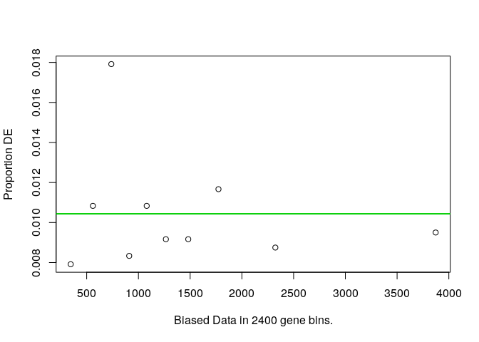

__Name:__ Zun Wang
__Student ID:__ 915109847

Insert your answers below.  Knit this file and submit the .Rmd and .html when you are done. 

```r
library(tidyverse)
```

```
## ── Attaching packages ───────────────────────────────────────────────────────────────────────── tidyverse 1.3.0 ──
```

```
## ✓ ggplot2 3.3.0     ✓ purrr   0.3.3
## ✓ tibble  2.1.3     ✓ dplyr   0.8.5
## ✓ tidyr   1.0.2     ✓ stringr 1.4.0
## ✓ readr   1.3.1     ✓ forcats 0.5.0
```

```
## ── Conflicts ──────────────────────────────────────────────────────────────────────────── tidyverse_conflicts() ──
## x dplyr::filter() masks stats::filter()
## x dplyr::lag()    masks stats::lag()
```

```r
library(goseq)
```

```
## Loading required package: BiasedUrn
```

```
## Loading required package: geneLenDataBase
```

```
## 
```

```r
library(rtracklayer)
```

```
## Loading required package: GenomicRanges
```

```
## Loading required package: stats4
```

```
## Loading required package: BiocGenerics
```

```
## Loading required package: parallel
```

```
## 
## Attaching package: 'BiocGenerics'
```

```
## The following objects are masked from 'package:parallel':
## 
##     clusterApply, clusterApplyLB, clusterCall, clusterEvalQ,
##     clusterExport, clusterMap, parApply, parCapply, parLapply,
##     parLapplyLB, parRapply, parSapply, parSapplyLB
```

```
## The following objects are masked from 'package:dplyr':
## 
##     combine, intersect, setdiff, union
```

```
## The following objects are masked from 'package:stats':
## 
##     IQR, mad, sd, var, xtabs
```

```
## The following objects are masked from 'package:base':
## 
##     anyDuplicated, append, as.data.frame, basename, cbind, colnames,
##     dirname, do.call, duplicated, eval, evalq, Filter, Find, get, grep,
##     grepl, intersect, is.unsorted, lapply, Map, mapply, match, mget,
##     order, paste, pmax, pmax.int, pmin, pmin.int, Position, rank,
##     rbind, Reduce, rownames, sapply, setdiff, sort, table, tapply,
##     union, unique, unsplit, which, which.max, which.min
```

```
## Loading required package: S4Vectors
```

```
## 
## Attaching package: 'S4Vectors'
```

```
## The following object is masked from 'package:geneLenDataBase':
## 
##     unfactor
```

```
## The following objects are masked from 'package:dplyr':
## 
##     first, rename
```

```
## The following object is masked from 'package:tidyr':
## 
##     expand
```

```
## The following object is masked from 'package:base':
## 
##     expand.grid
```

```
## Loading required package: IRanges
```

```
## 
## Attaching package: 'IRanges'
```

```
## The following objects are masked from 'package:dplyr':
## 
##     collapse, desc, slice
```

```
## The following object is masked from 'package:purrr':
## 
##     reduce
```

```
## Loading required package: GenomeInfoDb
```

```r
library(GenomicRanges)
library(Biostrings)
```

```
## Loading required package: XVector
```

```
## 
## Attaching package: 'XVector'
```

```
## The following object is masked from 'package:purrr':
## 
##     compact
```

```
## 
## Attaching package: 'Biostrings'
```

```
## The following object is masked from 'package:base':
## 
##     strsplit
```


```r
DEgene.trt <- read_csv("../output/DEgenes.trt.csv")
```

```
## Warning: Missing column names filled in: 'X1' [1]
```

```
## Parsed with column specification:
## cols(
##   X1 = col_character(),
##   logFC = col_double(),
##   logCPM = col_double(),
##   LR = col_double(),
##   PValue = col_double(),
##   FDR = col_double()
## )
```

```r
head(DEgene.trt)
```

```
## # A tibble: 6 x 6
##   X1        logFC logCPM    LR   PValue      FDR
##   <chr>     <dbl>  <dbl> <dbl>    <dbl>    <dbl>
## 1 Bra028803 -5.04   3.51 132.  1.35e-30 3.25e-26
## 2 Bra019324  4.81   2.21  76.4 2.27e-18 2.73e-14
## 3 Bra034565  4.08   2.16  68.9 1.02e-16 8.16e-13
## 4 Bra025587  4.19   3.30  55.0 1.18e-13 7.08e-10
## 5 Bra029946  2.28   5.36  47.8 4.72e-12 1.90e- 8
## 6 Bra026156  1.76   6.47  47.5 5.48e-12 1.90e- 8
```

```r
colnames(DEgene.trt)[1] <- "GeneID"
head(DEgene.trt)
```

```
## # A tibble: 6 x 6
##   GeneID    logFC logCPM    LR   PValue      FDR
##   <chr>     <dbl>  <dbl> <dbl>    <dbl>    <dbl>
## 1 Bra028803 -5.04   3.51 132.  1.35e-30 3.25e-26
## 2 Bra019324  4.81   2.21  76.4 2.27e-18 2.73e-14
## 3 Bra034565  4.08   2.16  68.9 1.02e-16 8.16e-13
## 4 Bra025587  4.19   3.30  55.0 1.18e-13 7.08e-10
## 5 Bra029946  2.28   5.36  47.8 4.72e-12 1.90e- 8
## 6 Bra026156  1.76   6.47  47.5 5.48e-12 1.90e- 8
```

__Exercise 1__:  
__a.__ Import the gene descriptions that you downloaded; pay attention to the "col_names" argument.  What is appropriate here?  Use one of the `join()` functions (which one?) to add gene descriptions for the genes found to be regulated by the DP treatment.  Output a table of the top 10 genes that includes the output from edgeR and the descriptions.

```r
descrip <- read_table("../input/FileS9.txt",col_names = "General") 
```

```
## Parsed with column specification:
## cols(
##   General = col_character()
## )
```

```r
descrip <- descrip %>% separate(General,c("GeneID","Description"),"\t") #need to add column name here
```

```r
DEgene.trt <- inner_join(DEgene.trt,descrip)
```

```
## Joining, by = "GeneID"
```

```r
head(DEgene.trt,n=10)
```

```
## # A tibble: 10 x 7
##    GeneID   logFC logCPM    LR   PValue      FDR Description                    
##    <chr>    <dbl>  <dbl> <dbl>    <dbl>    <dbl> <chr>                          
##  1 Bra0288… -5.04   3.51 132.  1.35e-30 3.25e-26 Phosphoglycerate mutase family…
##  2 Bra0193…  4.81   2.21  76.4 2.27e-18 2.73e-14 cysteine-rich RLK (RECEPTOR-li…
##  3 Bra0345…  4.08   2.16  68.9 1.02e-16 8.16e-13 myb domain protein 69          
##  4 Bra0255…  4.19   3.30  55.0 1.18e-13 7.08e-10 Protein of unknown function (D…
##  5 Bra0299…  2.28   5.36  47.8 4.72e-12 1.90e- 8 Cysteine proteinases superfami…
##  6 Bra0261…  1.76   6.47  47.5 5.48e-12 1.90e- 8 pleiotropic drug resistance 7  
##  7 Bra0301…  2.85   5.11  47.5 5.53e-12 1.90e- 8 Leucine-rich repeat transmembr…
##  8 Bra0377…  2.04   4.54  47.1 6.76e-12 2.03e- 8 Plant invertase/pectin methyle…
##  9 Bra0160…  5.12   1.76  46.0 1.18e-11 3.14e- 8 Protein kinase superfamily pro…
## 10 Bra0290…  3.50   1.24  45.6 1.45e-11 3.49e- 8 No annotation found
```


__b.__ Repeat this for  genes with a genotype x trt interaction.

```r
DEgene.interaction <- read_csv("../output/DEgenes.interaction.csv")
```

```
## Warning: Missing column names filled in: 'X1' [1]
```

```
## Parsed with column specification:
## cols(
##   X1 = col_character(),
##   logFC = col_double(),
##   logCPM = col_double(),
##   LR = col_double(),
##   PValue = col_double(),
##   FDR = col_double()
## )
```

```r
colnames(DEgene.interaction)[1] <- "GeneID"
DEgene.interaction <- inner_join(DEgene.interaction,descrip)
```

```
## Joining, by = "GeneID"
```

```r
head(DEgene.interaction,n=10)
```

```
## # A tibble: 10 x 7
##    GeneID   logFC logCPM    LR   PValue      FDR Description                    
##    <chr>    <dbl>  <dbl> <dbl>    <dbl>    <dbl> <chr>                          
##  1 Bra0108…  6.66   6.04 153.  3.46e-35 8.32e-31 GDSL-like Lipase/Acylhydrolase…
##  2 Bra0330… -4.64   6.61  71.2 3.18e-17 3.82e-13 Nodulin MtN3 family protein    
##  3 Bra0353… -4.14   4.67  68.2 1.47e-16 1.17e-12 HXXXD-type acyl-transferase fa…
##  4 Bra0035… -4.89   3.90  54.1 1.89e-13 1.14e- 9 Wall-associated kinase family …
##  5 Bra0161…  7.71   6.33  49.6 1.87e-12 9.00e- 9 MLP-like protein 28            
##  6 Bra0131…  4.10   9.33  48.0 4.21e-12 1.69e- 8 xyloglucan endotransglucosylas…
##  7 Bra0094…  6.20   6.59  47.4 5.84e-12 2.01e- 8 Plant invertase/pectin methyle…
##  8 Bra0338… -3.23   5.72  47.1 6.91e-12 2.07e- 8 pinoresinol reductase 1        
##  9 Bra0111…  5.02   3.35  46.5 9.35e-12 2.50e- 8 glycine-rich protein           
## 10 Bra0410… -3.28   7.16  45.8 1.31e-11 3.15e- 8 S-adenosylmethionine synthetas…
```

__Exercise 2__:  

```r
go.terms <- read_tsv("../input/FileS11.txt",col_names=FALSE)
```

```
## Parsed with column specification:
## cols(
##   X1 = col_character(),
##   X2 = col_character()
## )
```

```r
head(go.terms)
```

```
## # A tibble: 6 x 2
##   X1        X2                                                                  
##   <chr>     <chr>                                                               
## 1 Bra002000 GO:0005488                                                          
## 2 Bra001201 GO:0000160,GO:0009927,GO:0000155,GO:0018106,GO:0005524,GO:0004740,G…
## 3 Bra001122 GO:0050832,GO:0016023,GO:0008061,GO:0042742                         
## 4 Bra001115 GO:0009825,GO:0001578,GO:0055028,GO:0007163,GO:0010031,GO:0010015,G…
## 5 Bra001108 GO:0000166,GO:0003723                                               
## 6 Bra001050 GO:0070628,GO:0043130,GO:0005634
```

```r
colnames(go.terms) <- c("GeneID","GO")
head(go.terms)
```

```
## # A tibble: 6 x 2
##   GeneID    GO                                                                  
##   <chr>     <chr>                                                               
## 1 Bra002000 GO:0005488                                                          
## 2 Bra001201 GO:0000160,GO:0009927,GO:0000155,GO:0018106,GO:0005524,GO:0004740,G…
## 3 Bra001122 GO:0050832,GO:0016023,GO:0008061,GO:0042742                         
## 4 Bra001115 GO:0009825,GO:0001578,GO:0055028,GO:0007163,GO:0010031,GO:0010015,G…
## 5 Bra001108 GO:0000166,GO:0003723                                               
## 6 Bra001050 GO:0070628,GO:0043130,GO:0005634
```

```r
expressed.genes <- read_tsv("../input/internode_expressed_genes.txt")
```

```
## Parsed with column specification:
## cols(
##   x = col_character()
## )
```

```r
head(expressed.genes)
```

```
## # A tibble: 6 x 1
##   x        
##   <chr>    
## 1 Bra000002
## 2 Bra000003
## 3 Bra000005
## 4 Bra000006
## 5 Bra000007
## 6 Bra000008
```

```r
names(expressed.genes) <- "GeneID"

gene.lengths <- read_tsv("../input/Brapa_CDS_lengths.txt")
```

```
## Parsed with column specification:
## cols(
##   GeneID = col_character(),
##   Length = col_double()
## )
```

```r
head(gene.lengths)
```

```
## # A tibble: 6 x 2
##   GeneID    Length
##   <chr>      <dbl>
## 1 Bra000001   1515
## 2 Bra000002   1089
## 3 Bra000003    570
## 4 Bra000004    375
## 5 Bra000005   1434
## 6 Bra000006    312
```

```r
#we need to reduce the gene.length data to only contain entries for those genes in our expressed.genes set.  We also need this as a vector
gene.lengths.vector <- gene.lengths$Length[gene.lengths$GeneID %in% expressed.genes$GeneID]
names(gene.lengths.vector) <- gene.lengths$GeneID[gene.lengths$GeneID %in% expressed.genes$GeneID]
head(gene.lengths.vector)
```

```
## Bra000002 Bra000003 Bra000005 Bra000006 Bra000007 Bra000008 
##      1089       570      1434       312       711       882
```

```r
#Do the reverse to make sure everything matches up (it seems that we don't have length info for some genes?)
expressed.genes.match <- expressed.genes[expressed.genes$GeneID %in% names(gene.lengths.vector),]
```

```r
go.list <- strsplit(go.terms$GO,split=",")
names(go.list) <- go.terms$GeneID
head(go.list)
```

```
## $Bra002000
## [1] "GO:0005488"
## 
## $Bra001201
## [1] "GO:0000160" "GO:0009927" "GO:0000155" "GO:0018106" "GO:0005524"
## [6] "GO:0004740" "GO:0005739"
## 
## $Bra001122
## [1] "GO:0050832" "GO:0016023" "GO:0008061" "GO:0042742"
## 
## $Bra001115
## [1] "GO:0009825" "GO:0001578" "GO:0055028" "GO:0007163" "GO:0010031"
## [6] "GO:0010015" "GO:0010091"
## 
## $Bra001108
## [1] "GO:0000166" "GO:0003723"
## 
## $Bra001050
## [1] "GO:0070628" "GO:0043130" "GO:0005634"
```

```r
DE.interaction <- expressed.genes.match$GeneID %in% DEgene.interaction$GeneID
    #for each gene in expressed gene, return FALSE if it is not in DEgene.trt and TRUE if it is.
names(DE.interaction) <- expressed.genes.match$GeneID
head(DE.interaction)
```

```
## Bra000002 Bra000003 Bra000005 Bra000006 Bra000007 Bra000008 
##     FALSE     FALSE     FALSE     FALSE     FALSE     FALSE
```

```r
DE.interaction <- as.numeric(DE.interaction) #convert to 0s and 1s
head(DE.interaction)
```

```
## [1] 0 0 0 0 0 0
```

```r
sum(DE.interaction)
```

```
## [1] 243
```

```r
#determines if there is bias due to gene length.  The plot shows the relationship.
nullp.result <- nullp(DEgenes = DE.interaction,bias.data = gene.lengths.vector)
```

```
## Warning in pcls(G): initial point very close to some inequality constraints
```

<!-- -->

```r
#calculate p-values for each GO term
rownames(nullp.result) <- names(gene.lengths.vector) #because of a bug in nullp()
GO.out <- goseq(pwf = nullp.result,gene2cat = go.list,test.cats=("GO:BP"))
```

```
## Using manually entered categories.
```

```
## For 3878 genes, we could not find any categories. These genes will be excluded.
```

```
## To force their use, please run with use_genes_without_cat=TRUE (see documentation).
```

```
## This was the default behavior for version 1.15.1 and earlier.
```

```
## Calculating the p-values...
```

```
## 'select()' returned 1:1 mapping between keys and columns
```

```r
#list over-represented GO terms (p < 0.05)
GO.out[GO.out$over_represented_pvalue < 0.05,]
```

```
##        category over_represented_pvalue under_represented_pvalue numDEInCat
## 3568 GO:0043086            0.0002754293                0.9999683          6
## 3136 GO:0030599            0.0003034686                0.9999735          5
## 3601 GO:0043295            0.0008855641                0.9999646          3
## 57   GO:0000184            0.0027577165                0.9999444          2
## 181  GO:0001676            0.0035219961                0.9999173          2
## 3965 GO:0048046            0.0035273345                0.9987427         13
## 1873 GO:0009651            0.0036665359                0.9985779         15
## 3506 GO:0042545            0.0048909021                0.9996236          3
## 3704 GO:0045330            0.0048909021                0.9996236          3
## 1371 GO:0007047            0.0058927951                0.9992247          4
## 1211 GO:0006561            0.0063289104                0.9997881          2
## 881  GO:0005618            0.0065442587                0.9974859         13
## 770  GO:0004857            0.0077242391                0.9992927          3
## 1348 GO:0006979            0.0081446849                0.9976323          8
## 949  GO:0005789            0.0085603454                0.9987428          4
## 3227 GO:0031540            0.0086106800                0.9996547          2
## 853  GO:0005476            0.0101514995                1.0000000          1
## 4127 GO:0050616            0.0101514995                1.0000000          1
## 976  GO:0005872            0.0101514995                1.0000000          1
## 1012 GO:0006011            0.0101514995                1.0000000          1
## 1577 GO:0008569            0.0101514995                1.0000000          1
## 2057 GO:0009971            0.0101514995                1.0000000          1
## 2383 GO:0010491            0.0101514995                1.0000000          1
## 3320 GO:0033356            0.0101514995                1.0000000          1
## 3533 GO:0042775            0.0101514995                1.0000000          1
## 3784 GO:0046398            0.0101514995                1.0000000          1
## 3902 GO:0047338            0.0101514995                1.0000000          1
## 3905 GO:0047350            0.0101514995                1.0000000          1
## 4136 GO:0050688            0.0101514995                1.0000000          1
## 4283 GO:0052573            0.0101514995                1.0000000          1
## 2143 GO:0010105            0.0140973788                0.9992487          2
## 2963 GO:0019430            0.0172758904                0.9989659          2
## 1794 GO:0009505            0.0195663634                0.9928469          9
## 21   GO:0000064            0.0202004640                0.9998975          1
## 384  GO:0004076            0.0202004640                0.9998975          1
## 1262 GO:0006729            0.0202004640                0.9998975          1
## 1447 GO:0008124            0.0202004640                0.9998975          1
## 2007 GO:0009898            0.0202004640                0.9998975          1
## 2864 GO:0017103            0.0202004640                0.9998975          1
## 3271 GO:0032456            0.0202004640                0.9998975          1
## 3373 GO:0034450            0.0202004640                0.9998975          1
## 3461 GO:0042170            0.0202004640                0.9998975          1
## 3643 GO:0043903            0.0202004640                0.9998975          1
## 3656 GO:0044249            0.0202004640                0.9998975          1
## 4053 GO:0048730            0.0202004640                0.9998975          1
## 4181 GO:0051179            0.0202004640                0.9998975          1
## 3832 GO:0046686            0.0202654434                0.9906970         14
## 915  GO:0005740            0.0207275703                0.9986238          2
## 984  GO:0005887            0.0211298887                0.9971508          3
## 2040 GO:0009944            0.0225520156                0.9984291          2
## 3174 GO:0031072            0.0229507275                0.9954605          4
## 2065 GO:0009986            0.0244402014                0.9982180          2
## 44   GO:0000155            0.0263906595                0.9979901          2
## 3861 GO:0046910            0.0284019446                0.9977448          2
## 606  GO:0004601            0.0284190523                0.9956963          3
## 936  GO:0005773            0.0301224500                0.9868711         11
## 733  GO:0004814            0.0301479237                0.9996945          1
## 1144 GO:0006420            0.0301479237                0.9996945          1
## 2213 GO:0010222            0.0301479237                0.9996945          1
## 3689 GO:0045174            0.0301479237                0.9996945          1
## 3881 GO:0047012            0.0301479237                0.9996945          1
## 2676 GO:0016246            0.0301479237                0.9996945          1
## 4280 GO:0052542            0.0301479237                0.9996945          1
## 133  GO:0000741            0.0301479237                0.9996945          1
## 325  GO:0003983            0.0301479237                0.9996945          1
## 514  GO:0004418            0.0301479237                0.9996945          1
## 516  GO:0004420            0.0301479237                0.9996945          1
## 656  GO:0004666            0.0301479237                0.9996945          1
## 1523 GO:0008395            0.0301479237                0.9996945          1
## 2067 GO:0009992            0.0301479237                0.9996945          1
## 2136 GO:0010094            0.0301479237                0.9996945          1
## 2605 GO:0015936            0.0301479237                0.9996945          1
## 2888 GO:0018160            0.0301479237                0.9996945          1
## 3196 GO:0031304            0.0301479237                0.9996945          1
## 3341 GO:0033858            0.0301479237                0.9996945          1
## 3474 GO:0042282            0.0301479237                0.9996945          1
## 2603 GO:0015934            0.0304726343                0.9974817          2
## 4164 GO:0051082            0.0332393427                0.9909772          5
## 2130 GO:0010087            0.0347866485                0.9969005          2
## 4130 GO:0050660            0.0377327053                0.9912800          4
## 2987 GO:0019722            0.0393217634                0.9962434          2
## 475  GO:0004350            0.0399948988                0.9993930          1
## 1710 GO:0009102            0.0399948988                0.9993930          1
## 1954 GO:0009805            0.0399948988                0.9993930          1
## 2318 GO:0010362            0.0399948988                0.9993930          1
## 2654 GO:0016127            0.0399948988                0.9993930          1
## 2861 GO:0017084            0.0399948988                0.9993930          1
## 2927 GO:0019156            0.0399948988                0.9993930          1
## 3234 GO:0031901            0.0399948988                0.9993930          1
## 3268 GO:0032450            0.0399948988                0.9993930          1
## 3372 GO:0034434            0.0399948988                0.9993930          1
## 3571 GO:0043091            0.0399948988                0.9993930          1
## 4001 GO:0048442            0.0399948988                0.9993930          1
## 4134 GO:0050665            0.0399948988                0.9993930          1
## 4427 GO:0071497            0.0399948988                0.9993930          1
## 1120 GO:0006355            0.0421620592                0.9760208         20
## 2155 GO:0010119            0.0422199690                0.9925172          3
## 2100 GO:0010043            0.0494175103                0.9906677          3
## 2445 GO:0015089            0.0497423994                0.9989951          1
## 473  GO:0004348            0.0497423994                0.9989951          1
## 751  GO:0004832            0.0497423994                0.9989951          1
## 1081 GO:0006259            0.0497423994                0.9989951          1
## 1162 GO:0006438            0.0497423994                0.9989951          1
## 1257 GO:0006680            0.0497423994                0.9989951          1
## 2080 GO:0010018            0.0497423994                0.9989951          1
## 2121 GO:0010074            0.0497423994                0.9989951          1
## 2165 GO:0010155            0.0497423994                0.9989951          1
## 2297 GO:0010330            0.0497423994                0.9989951          1
## 2373 GO:0010480            0.0497423994                0.9989951          1
## 2581 GO:0015822            0.0497423994                0.9989951          1
## 2665 GO:0016174            0.0497423994                0.9989951          1
## 3821 GO:0046592            0.0497423994                0.9989951          1
## 3945 GO:0047893            0.0497423994                0.9989951          1
## 4072 GO:0050062            0.0497423994                0.9989951          1
## 6    GO:0000015            0.0497423994                0.9989951          1
## 205  GO:0002679            0.0497423994                0.9989951          1
## 628  GO:0004634            0.0497423994                0.9989951          1
## 848  GO:0005457            0.0497423994                0.9989951          1
## 1754 GO:0009311            0.0497423994                0.9989951          1
## 2419 GO:0010731            0.0497423994                0.9989951          1
## 2563 GO:0015783            0.0497423994                0.9989951          1
##      numInCat
## 3568       88
## 3136       58
## 3601       19
## 57          8
## 181         9
## 3965      539
## 1873      672
## 3506       34
## 3704       34
## 1371       71
## 1211       12
## 881       581
## 770        40
## 1348      281
## 949        79
## 3227       14
## 853         1
## 4127        1
## 976         1
## 1012        1
## 1577        1
## 2057        1
## 2383        1
## 3320        1
## 3533        1
## 3784        1
## 3902        1
## 3905        1
## 4136        1
## 4283        1
## 2143       18
## 2963       20
## 1794      394
## 21          2
## 384         2
## 1262        2
## 1447        2
## 2007        2
## 2864        2
## 3271        2
## 3373        2
## 3461        2
## 3643        2
## 3656        2
## 4053        2
## 4181        2
## 3832      746
## 915        22
## 984        58
## 2040       23
## 3174      106
## 2065       24
## 44         25
## 3861       26
## 606        65
## 936       566
## 733         3
## 1144        3
## 2213        3
## 3689        3
## 3881        3
## 2676        3
## 4280        3
## 133         3
## 325         3
## 514         3
## 516         3
## 656         3
## 1523        3
## 2067        3
## 2136        3
## 2605        3
## 2888        3
## 3196        3
## 3341        3
## 3474        3
## 2603       27
## 4164      175
## 2130       29
## 4130      124
## 2987       31
## 475         4
## 1710        4
## 1954        4
## 2318        4
## 2654        4
## 2861        4
## 2927        4
## 3234        4
## 3268        4
## 3372        4
## 3571        4
## 4001        4
## 4134        4
## 4427        4
## 1120     1302
## 2155       76
## 2100       81
## 2445        5
## 473         5
## 751         5
## 1081        5
## 1162        5
## 1257        5
## 2080        5
## 2121        5
## 2165        5
## 2297        5
## 2373        5
## 2581        5
## 2665        5
## 3821        5
## 3945        5
## 4072        5
## 6           5
## 205         5
## 628         5
## 848         5
## 1754        5
## 2419        5
## 2563        5
##                                                                       term
## 3568                             negative regulation of catalytic activity
## 3136                                               pectinesterase activity
## 3601                                                   glutathione binding
## 57     nuclear-transcribed mRNA catabolic process, nonsense-mediated decay
## 181                                long-chain fatty acid metabolic process
## 3965                                                              apoplast
## 1873                                               response to salt stress
## 3506                                                cell wall modification
## 3704                                            aspartyl esterase activity
## 1371                                                                  <NA>
## 1211                                          proline biosynthetic process
## 881                                                              cell wall
## 770                                              enzyme inhibitor activity
## 1348                                          response to oxidative stress
## 949                                         endoplasmic reticulum membrane
## 3227                        regulation of anthocyanin biosynthetic process
## 853                           carnitine:acyl carnitine antiporter activity
## 4127                                         secologanin synthase activity
## 976                                              minus-end kinesin complex
## 1012                                         UDP-glucose metabolic process
## 1577          ATP-dependent microtubule motor activity, minus-end-directed
## 2057                    anastral spindle assembly involved in male meiosis
## 2383                UTP:arabinose-1-phosphate uridylyltransferase activity
## 3320                                     UDP-L-arabinose metabolic process
## 3533                mitochondrial ATP synthesis coupled electron transport
## 3784                                     UDP-glucuronate metabolic process
## 3902                   UTP:xylose-1-phosphate uridylyltransferase activity
## 3905                  glucuronate-1-phosphate uridylyltransferase activity
## 4136                               regulation of defense response to virus
## 4283                                     UDP-D-galactose metabolic process
## 2143           negative regulation of ethylene-activated signaling pathway
## 2963                                        removal of superoxide radicals
## 1794                                                  plant-type cell wall
## 21                          L-ornithine transmembrane transporter activity
## 384                                               biotin synthase activity
## 1262                              tetrahydrobiopterin biosynthetic process
## 1447               4-alpha-hydroxytetrahydrobiopterin dehydratase activity
## 2007                                   cytoplasmic side of plasma membrane
## 2864                UTP:galactose-1-phosphate uridylyltransferase activity
## 3271                                                   endocytic recycling
## 3373                                   ubiquitin-ubiquitin ligase activity
## 3461                                                      plastid membrane
## 3643    regulation of symbiosis, encompassing mutualism through parasitism
## 3656                                         cellular biosynthetic process
## 4053                                               epidermis morphogenesis
## 4181                                                          localization
## 3832                                               response to cadmium ion
## 915                                                 mitochondrial envelope
## 984                                  integral component of plasma membrane
## 2040                        polarity specification of adaxial/abaxial axis
## 3174                                            heat shock protein binding
## 2065                                                          cell surface
## 44                                     phosphorelay sensor kinase activity
## 3861                                     pectinesterase inhibitor activity
## 606                                                    peroxidase activity
## 936                                                                vacuole
## 733                                          arginine-tRNA ligase activity
## 1144                                           arginyl-tRNA aminoacylation
## 2213                                stem vascular tissue pattern formation
## 3689                        glutathione dehydrogenase (ascorbate) activity
## 3881 sterol-4-alpha-carboxylate 3-dehydrogenase (decarboxylating) activity
## 2676                                                      RNA interference
## 4280                                defense response by callose deposition
## 133                                                              karyogamy
## 325                   UTP:glucose-1-phosphate uridylyltransferase activity
## 514                                  hydroxymethylbilane synthase activity
## 516                   hydroxymethylglutaryl-CoA reductase (NADPH) activity
## 656                           prostaglandin-endoperoxide synthase activity
## 1523                                          steroid hydroxylase activity
## 2067                                            cellular water homeostasis
## 2136                                      specification of carpel identity
## 2605                                          coenzyme A metabolic process
## 2888                                peptidyl-pyrromethane cofactor linkage
## 3196                   intrinsic component of mitochondrial inner membrane
## 3341                                 N-acetylgalactosamine kinase activity
## 3474                          hydroxymethylglutaryl-CoA reductase activity
## 2603                                               large ribosomal subunit
## 4164                                              unfolded protein binding
## 2130                                          phloem or xylem histogenesis
## 4130                                   flavin adenine dinucleotide binding
## 2987                                            calcium-mediated signaling
## 475                        glutamate-5-semialdehyde dehydrogenase activity
## 1710                                           biotin biosynthetic process
## 1954                                         coumarin biosynthetic process
## 2318           negative regulation of anion channel activity by blue light
## 2654                                              sterol catabolic process
## 2861                    delta1-pyrroline-5-carboxylate synthetase activity
## 2927                                                   isoamylase activity
## 3234                                               early endosome membrane
## 3268                                    maltose alpha-glucosidase activity
## 3372                                                 sterol esterification
## 3571                                                                  <NA>
## 4001                                                     sepal development
## 4134                                hydrogen peroxide biosynthetic process
## 4427                                         cellular response to freezing
## 1120                            regulation of transcription, DNA-templated
## 2155                                       regulation of stomatal movement
## 2100                                                  response to zinc ion
## 2445           high-affinity copper ion transmembrane transporter activity
## 473                                            glucosylceramidase activity
## 751                                            valine-tRNA ligase activity
## 1081                                                 DNA metabolic process
## 1162                                             valyl-tRNA aminoacylation
## 1257                                    glucosylceramide catabolic process
## 2080                                       far-red light signaling pathway
## 2121                                      maintenance of meristem identity
## 2165                                        regulation of proton transport
## 2297                                            cellulose synthase complex
## 2373                                        microsporocyte differentiation
## 2581                                                   ornithine transport
## 2665                                              NAD(P)H oxidase activity
## 3821                                            polyamine oxidase activity
## 3945                             flavonol 3-O-glucosyltransferase activity
## 4072                          long-chain-fatty-acyl-CoA reductase activity
## 6                                        phosphopyruvate hydratase complex
## 205                         respiratory burst involved in defense response
## 628                                     phosphopyruvate hydratase activity
## 848                          GDP-fucose transmembrane transporter activity
## 1754                                     oligosaccharide metabolic process
## 2419                                             protein glutathionylation
## 2563                                    GDP-fucose transmembrane transport
##      ontology
## 3568       BP
## 3136       MF
## 3601       MF
## 57         BP
## 181        BP
## 3965       CC
## 1873       BP
## 3506       BP
## 3704       MF
## 1371     <NA>
## 1211       BP
## 881        CC
## 770        MF
## 1348       BP
## 949        CC
## 3227       BP
## 853        MF
## 4127       MF
## 976        CC
## 1012       BP
## 1577       MF
## 2057       BP
## 2383       MF
## 3320       BP
## 3533       BP
## 3784       BP
## 3902       MF
## 3905       MF
## 4136       BP
## 4283       BP
## 2143       BP
## 2963       BP
## 1794       CC
## 21         MF
## 384        MF
## 1262       BP
## 1447       MF
## 2007       CC
## 2864       MF
## 3271       BP
## 3373       MF
## 3461       CC
## 3643       BP
## 3656       BP
## 4053       BP
## 4181       BP
## 3832       BP
## 915        CC
## 984        CC
## 2040       BP
## 3174       MF
## 2065       CC
## 44         MF
## 3861       MF
## 606        MF
## 936        CC
## 733        MF
## 1144       BP
## 2213       BP
## 3689       MF
## 3881       MF
## 2676       BP
## 4280       BP
## 133        BP
## 325        MF
## 514        MF
## 516        MF
## 656        MF
## 1523       MF
## 2067       BP
## 2136       BP
## 2605       BP
## 2888       BP
## 3196       CC
## 3341       MF
## 3474       MF
## 2603       CC
## 4164       MF
## 2130       BP
## 4130       MF
## 2987       BP
## 475        MF
## 1710       BP
## 1954       BP
## 2318       BP
## 2654       BP
## 2861       MF
## 2927       MF
## 3234       CC
## 3268       MF
## 3372       BP
## 3571     <NA>
## 4001       BP
## 4134       BP
## 4427       BP
## 1120       BP
## 2155       BP
## 2100       BP
## 2445       MF
## 473        MF
## 751        MF
## 1081       BP
## 1162       BP
## 1257       BP
## 2080       BP
## 2121       BP
## 2165       BP
## 2297       CC
## 2373       BP
## 2581       BP
## 2665       MF
## 3821       MF
## 3945       MF
## 4072       MF
## 6          CC
## 205        BP
## 628        MF
## 848        MF
## 1754       BP
## 2419       BP
## 2563       BP
```

```r
write.table(GO.out[GO.out$over_represented_pvalue < 0.05,1:2],row.names=FALSE,file="../output/GO_terms.txt", quote = FALSE,col.names = FALSE)
```

__a:__ In REVIGO display a "TreeMap" of the BP GO terms.  Was our hypothesis that cell wall genes are enriched in the genotype X treatment gene set correct?  You DO NOT need to include the treemap in your answer.

Yes, the terms related to cell wall are overly represented in the selected GO terms, although not the biggest part but have its space in the BP GO treemap.

__b:__ Display a "TreeMap" of the CC GO terms.  There are four general categories shown, some with sub-categories.  What are the two general categories with the largest number of sub categories?  How might any of the four general categories relate to differences in plant growth?  (Note that the apoplast is the area outside of the plasma membrane, including the cell wall.  You DO NOT need to include the treemap in your answer.

The largest one is ER membrane, it might be related to membrane protein recycle rate. The second largest is cell wall, which might be related to plant cell wall organization. Others are cell surface and apoplast, which may related to cell signaling.

__Exercise_3: __Flanking sequences could be defined in a variety of ways.  We want `flank()` to take sequences upstream, not downstream of the mRNAs.  Also, remember that genes can be transcribed from the "+" (upper) or "-" (lower) DNA strand.  Thus we want `flank()` to take coding strand into consideration and take sequences that are upstream of the 5' end of the gene.  Examine the mRNA and promoter ranges for the first couple of genes to determine if `flank()` has done what we want.  Explain how you know.


```r
gff <- import.gff("../../Assignment_5_Wang.Zun/input/Brapa_reference/Brapa_gene_v1.5.gff")
gff
```

```
## GRanges object with 288624 ranges and 7 metadata columns:
##                  seqnames          ranges strand |   source     type     score
##                     <Rle>       <IRanges>  <Rle> | <factor> <factor> <numeric>
##        [1]            A03 8794511-8797095      + |     blat     gene         1
##        [2]            A03 8794511-8797095      + |     blat     mRNA         1
##        [3]            A03 8794511-8794534      + |     blat      CDS       100
##        [4]            A03 8794622-8794805      + |     blat      CDS       100
##        [5]            A03 8795258-8795339      + |     blat      CDS       100
##        ...            ...             ...    ... .      ...      ...       ...
##   [288620] Scaffold005112         131-295      + |     blat     mRNA         1
##   [288621] Scaffold005112         131-295      + |     blat      CDS       100
##   [288622] Scaffold008211          18-251      + |    glean     gene  0.970334
##   [288623] Scaffold008211          18-251      + |    glean     mRNA  0.970334
##   [288624] Scaffold008211          18-251      + |    glean      CDS      <NA>
##                phase          ID        Name          Parent
##            <integer> <character> <character> <CharacterList>
##        [1]      <NA>   Bra000001   Bra000001                
##        [2]      <NA>   Bra000001   Bra000001                
##        [3]      <NA>        <NA>        <NA>       Bra000001
##        [4]      <NA>        <NA>        <NA>       Bra000001
##        [5]      <NA>        <NA>        <NA>       Bra000001
##        ...       ...         ...         ...             ...
##   [288620]      <NA>   Bra041173   Bra041173                
##   [288621]      <NA>        <NA>        <NA>       Bra041173
##   [288622]      <NA>   Bra041174   Bra041174                
##   [288623]      <NA>   Bra041174   Bra041174                
##   [288624]         0        <NA>        <NA>       Bra041174
##   -------
##   seqinfo: 284 sequences from an unspecified genome; no seqlengths
```

```r
mRNAranges <- gff[gff$type=="mRNA",c("type", "ID")]
mRNAranges
```

```
## GRanges object with 41020 ranges and 2 metadata columns:
##                 seqnames          ranges strand |     type          ID
##                    <Rle>       <IRanges>  <Rle> | <factor> <character>
##       [1]            A03 8794511-8797095      + |     mRNA   Bra000001
##       [2]            A03 8797899-8800379      - |     mRNA   Bra000002
##       [3]            A03 8812470-8813271      + |     mRNA   Bra000003
##       [4]            A03 8816858-8817232      + |     mRNA   Bra000004
##       [5]            A03 8818081-8820123      - |     mRNA   Bra000005
##       ...            ...             ...    ... .      ...         ...
##   [41016] Scaffold004047          11-321      + |     mRNA   Bra041170
##   [41017] Scaffold004813         190-414      - |     mRNA   Bra041171
##   [41018] Scaffold004894           3-410      + |     mRNA   Bra041172
##   [41019] Scaffold005112         131-295      + |     mRNA   Bra041173
##   [41020] Scaffold008211          18-251      + |     mRNA   Bra041174
##   -------
##   seqinfo: 284 sequences from an unspecified genome; no seqlengths
```

```r
mRNAranges <- mRNAranges[str_detect(seqnames(mRNAranges), "Scaffold", negate = TRUE), ]
mRNAranges
```

```
## GRanges object with 39609 ranges and 2 metadata columns:
##           seqnames            ranges strand |     type          ID
##              <Rle>         <IRanges>  <Rle> | <factor> <character>
##       [1]      A03   8794511-8797095      + |     mRNA   Bra000001
##       [2]      A03   8797899-8800379      - |     mRNA   Bra000002
##       [3]      A03   8812470-8813271      + |     mRNA   Bra000003
##       [4]      A03   8816858-8817232      + |     mRNA   Bra000004
##       [5]      A03   8818081-8820123      - |     mRNA   Bra000005
##       ...      ...               ...    ... .      ...         ...
##   [39605]      A08 11283500-11285461      - |     mRNA   Bra040840
##   [39606]      A09 26845542-26846612      + |     mRNA   Bra041026
##   [39607]      A09 26848837-26850491      - |     mRNA   Bra041027
##   [39608]      A09   6389757-6392224      + |     mRNA   Bra041081
##   [39609]      A09   6394063-6397281      + |     mRNA   Bra041082
##   -------
##   seqinfo: 284 sequences from an unspecified genome; no seqlengths
```

```r
promoterRanges <- flank(mRNAranges, 1500)
promoterRanges
```

```
## GRanges object with 39609 ranges and 2 metadata columns:
##           seqnames            ranges strand |     type          ID
##              <Rle>         <IRanges>  <Rle> | <factor> <character>
##       [1]      A03   8793011-8794510      + |     mRNA   Bra000001
##       [2]      A03   8800380-8801879      - |     mRNA   Bra000002
##       [3]      A03   8810970-8812469      + |     mRNA   Bra000003
##       [4]      A03   8815358-8816857      + |     mRNA   Bra000004
##       [5]      A03   8820124-8821623      - |     mRNA   Bra000005
##       ...      ...               ...    ... .      ...         ...
##   [39605]      A08 11285462-11286961      - |     mRNA   Bra040840
##   [39606]      A09 26844042-26845541      + |     mRNA   Bra041026
##   [39607]      A09 26850492-26851991      - |     mRNA   Bra041027
##   [39608]      A09   6388257-6389756      + |     mRNA   Bra041081
##   [39609]      A09   6392563-6394062      + |     mRNA   Bra041082
##   -------
##   seqinfo: 284 sequences from an unspecified genome; no seqlengths
```

For + strands, flank takes the regions in numbers 1500 bases before the mRNA regions to be the promoter regions, and for - strands, flank takes the regions in numbers 1500 bases after the mRNA regions so that the promoters are counted from the 5' end before the mRNA, instead of only minus the number in regions.


__Exercise 4__  

```r
Brapaseq <- readDNAStringSet("../../Assignment_5_Wang.Zun/input/Brapa_reference/BrapaV1.5_chrom_only.fa")
```

```r
names(Brapaseq)
```

```
##  [1] "A01 [12.17-2010]" "A02 [12.17-2010]" "A03 [12.17-2010]" "A04 [12.17-2010]"
##  [5] "A05 [12.17-2010]" "A06 [12.17-2010]" "A07 [12.17-2010]" "A08 [12.17-2010]"
##  [9] "A09 [12.17-2010]" "A10 [12.17-2010]"
```

```r
names(Brapaseq) <- str_remove(names(Brapaseq), " \\[.*")
names(Brapaseq)
```

```
##  [1] "A01" "A02" "A03" "A04" "A05" "A06" "A07" "A08" "A09" "A10"
```

```r
promoters <- Brapaseq[promoterRanges]
names(promoters) <- promoterRanges$ID
promoters
```

```
##   A DNAStringSet instance of length 39609
##         width seq                                           names               
##     [1]  1500 TATCATTCTCCCAAACCCAAA...AGAGCGTTCTATTGCAGAAAC Bra000001
##     [2]  1500 CTTAGATAATAACTTTAGATC...TTATTTAGTATTTTTTTTTTT Bra000002
##     [3]  1500 TCTAAGTAACCAGGGCGTTAG...CTTCTCTTGCTTTAGCTGGAT Bra000003
##     [4]  1500 AAATGTATTCACGATTGTGTT...GCTTTAAGAAGCAACCTTTCG Bra000004
##     [5]  1500 CGTGGCTCCGATCACCGAGTG...TAGAAAACATCAATCTTTTTA Bra000005
##     ...   ... ...
## [39605]  1500 AATATCTCTGGTTTAGTACAT...GTAAAAGACACAGGTGATTTA Bra040840
## [39606]  1500 GAGATAACTTACACGAAGACT...CGTCTCAGGATGCTCTGGATC Bra041026
## [39607]  1500 TAACAAAATTATATGAGCTCT...TTATATATTTTCCTTAATTTT Bra041027
## [39608]  1500 NNNNNNNNNNNNNNNNNNNNN...AAAACCAAAGTAAGTTGAACA Bra041081
## [39609]  1500 GAAGCGGATACTCGTAATCAT...CAAATCTCTCTCTCTTCTTCC Bra041082
```

```r
promoters <- DNAStringSet(gsub("N","-",promoters))

promoters
```

```
##   A DNAStringSet instance of length 39609
##         width seq                                           names               
##     [1]  1500 TATCATTCTCCCAAACCCAAA...AGAGCGTTCTATTGCAGAAAC Bra000001
##     [2]  1500 CTTAGATAATAACTTTAGATC...TTATTTAGTATTTTTTTTTTT Bra000002
##     [3]  1500 TCTAAGTAACCAGGGCGTTAG...CTTCTCTTGCTTTAGCTGGAT Bra000003
##     [4]  1500 AAATGTATTCACGATTGTGTT...GCTTTAAGAAGCAACCTTTCG Bra000004
##     [5]  1500 CGTGGCTCCGATCACCGAGTG...TAGAAAACATCAATCTTTTTA Bra000005
##     ...   ... ...
## [39605]  1500 AATATCTCTGGTTTAGTACAT...GTAAAAGACACAGGTGATTTA Bra040840
## [39606]  1500 GAGATAACTTACACGAAGACT...CGTCTCAGGATGCTCTGGATC Bra041026
## [39607]  1500 TAACAAAATTATATGAGCTCT...TTATATATTTTCCTTAATTTT Bra041027
## [39608]  1500 ---------------------...AAAACCAAAGTAAGTTGAACA Bra041081
## [39609]  1500 GAAGCGGATACTCGTAATCAT...CAAATCTCTCTCTCTTCTTCC Bra041082
```


```r
motifs <- read.delim("../input/element_name_and_motif_IUPACsupp.txt",header=FALSE,as.is=TRUE)
head(motifs)
```

```
##                              V1             V2
## 1     ABFs binding site motif         CACGTGGC
## 2      ABRE binding site motif        YACGTGGC
## 3 ABRE-like binding site motif        BACGTGKM
## 4           ACE promoter motif      GACACGTAGA
## 5        AG binding site motif  TTDCCWWWWWWGGH
## 6                 AG BS in AP3     CCATTTTTAGT
```

```r
motifsV <- as.character(motifs[,2])
names(motifsV) <- motifs[,1]
motifsSS <- DNAStringSet(motifsV)
motifsSS
```

```
##   A DNAStringSet instance of length 100
##       width seq                                             names               
##   [1]     8 CACGTGGC                                        ABFs binding site...
##   [2]     8 YACGTGGC                                        ABRE binding site...
##   [3]     8 BACGTGKM                                        ABRE-like binding...
##   [4]    10 GACACGTAGA                                      ACE promoter motif 
##   [5]    14 TTDCCWWWWWWGGH                                  AG binding site m...
##   ...   ... ...
##  [96]     5 GGGCC                                           SORLIP2 
##  [97]     9 CTCAAGTGA                                       SORLIP3 
##  [98]     9 GTATGATGG                                       SORLIP4 
##  [99]     7 GAGTGAG                                         SORLIP5
## [100]    11 YCYAACGGYYA                                     MSA
```

```r
DEgene.interaction.match <- DEgene.interaction$GeneID[DEgene.interaction$GeneID %in% names(promoters)]

expressed.genes.match <- expressed.genes$GeneID[expressed.genes$GeneID %in% names(promoters)]

#subset promoter files
universe.promoters <- promoters[expressed.genes.match]
target.promoters <- promoters[DEgene.interaction.match]
```


```r
#create a function to summarize the results and test for significance
motifEnrichment <- function(target.promoters,universe.promoters,all.counts=F,motifs=motifsSS) {
  
  #use vcountPDict to count the occurrences of each motif in each promoter
  target.counts <- vcountPDict(motifs,target.promoters,fixed=F) + 
    vcountPDict(motifsSS,reverseComplement(target.promoters),fixed=F)
  universe.counts <- vcountPDict(motifs,universe.promoters,fixed=F) + 
    vcountPDict(motifsSS,reverseComplement(universe.promoters),fixed=F)
  
  if (all.counts) { 
    #count all occurrences of a motif instead of the number of promoters that it occurs in
    target.counts.sum <- apply(target.counts,1,sum)
    universe.counts.sum <- apply(universe.counts,1,sum)
  } else {
    target.counts.sum <- apply(ifelse(target.counts > 0,1,0),1,sum)
    universe.counts.sum <- apply(ifelse(universe.counts > 0 , 1, 0),1,sum)
  }
  n.motifs <- length(target.counts.sum)
  results <- vector(mode="numeric",length=n.motifs)
  for (i in 1:n.motifs) {
    if (all.counts) { #the contigency tables are different depending on whether we are looking at promoters or overall occurrences
      #test if ratio of occurrences to promoters is the same in the target and the universe
      m <- matrix(c(
        target.counts.sum[i],                       #number of occurrences within target
        dim(target.counts)[2],                      #number of promoters in target
        universe.counts.sum[i],                  #number of occurrences within universe
        dim(universe.counts)[2]                  #number of promoters in universe
      ),ncol=2)
    } else { #looking at promoters with and without hits
      m <- matrix(c(
        target.counts.sum[i],                        #number of promoters in target with hit
        dim(target.counts)[2]-target.counts.sum[i],            #number of promoters in target with no hit
        universe.counts.sum[i],                   #number of promoters in universe with hit
        dim(universe.counts)[2]-universe.counts.sum[i]   #number of promoters in universe with no hit
      ),ncol=2)
    } #else
    results[i] <- fisher.test(m,alternative="greater")$p.value
  } #for loop
  results.table <- data.frame(
    motif=names(motifs),
    universe.percent = round(universe.counts.sum/dim(universe.counts)[2],3)*100,
    target.percent = round(target.counts.sum/dim(target.counts)[2],3)*100,
    p.value =  results)
  results.table <- results.table[order(results.table$p.value),]
  results.table
}
```

```r
motif.results <- motifEnrichment(target.promoters,universe.promoters)
head(motif.results)
```

```
##                        motif universe.percent target.percent      p.value
## 92                 SORLREP3              14.4           27.6 9.177010e-08
## 20        AtMYC2 BS in RD22              48.9           60.3 2.848386e-04
## 55    L1-box promoter motif              22.1           29.3 5.714748e-03
## 63  MYB3 binding site motif               7.7           12.6 6.143383e-03
## 72          PRHA BS in PAL1               0.0            0.4 2.068313e-02
## 15 ATHB1 binding site motif               2.4            4.6 3.489094e-02
```

__a.__ How many motifs are enriched at P < 0.05? 

```r
nrow(subset(motif.results,p.value<0.05))
```

```
## [1] 6
```

__b.__ What is the identity of the most significantly over-enriched promoter?  
  SORLREP3

__c.__ What percentage of genes in the "Universe" have this motif?  What percentage in our target set?

in universe: 14.4
in target: 27.6

__d.__ You can find information on the motifs [here](http://arabidopsis.med.ohio-state.edu/AtcisDB/bindingsites.html).  Given the experimental treatments used in this experiment, do you think that the most enriched motif represents a biologically meaningful result?  Discuss why or why not.

yes, because it is about light regulation, and it corresponds perfectly with  the nature of sun/shadow treatment. We can intepret it as due to the light change, the plant regulate correspondently.

