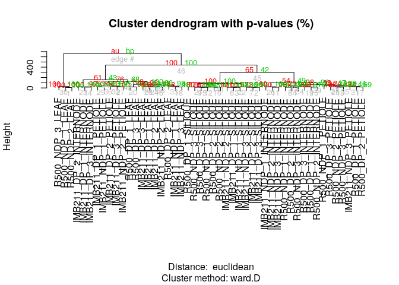
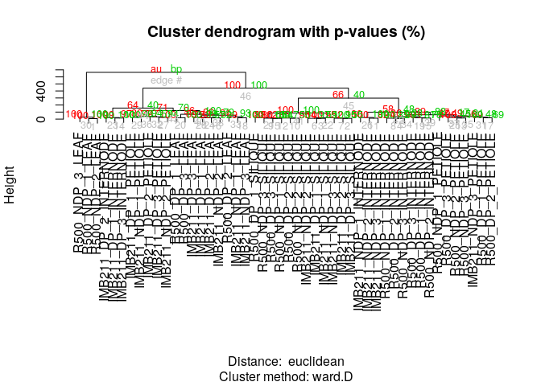

__Student Name:__ Zun Wang
__Student ID:__ 915109847

## Assignment 7: Gene Networks

```r
library(tidyverse)
```

```
## ── Attaching packages ───────────────────────────────────────────────────────────────────────── tidyverse 1.3.0 ──
```

```
## ✓ ggplot2 3.3.0     ✓ purrr   0.3.3
## ✓ tibble  2.1.3     ✓ dplyr   0.8.5
## ✓ tidyr   1.0.2     ✓ stringr 1.4.0
## ✓ readr   1.3.1     ✓ forcats 0.5.0
```

```
## ── Conflicts ──────────────────────────────────────────────────────────────────────────── tidyverse_conflicts() ──
## x dplyr::filter() masks stats::filter()
## x dplyr::lag()    masks stats::lag()
```

```r
library(ggdendro)
```

```r
cities <- read.delim("../input/us_cities.txt",row.names = 1)

head(cities)
```

<div data-pagedtable="false">
  <script data-pagedtable-source type="application/json">
{"columns":[{"label":[""],"name":["_rn_"],"type":[""],"align":["left"]},{"label":["BOS"],"name":[1],"type":["dbl"],"align":["right"]},{"label":["NY"],"name":[2],"type":["dbl"],"align":["right"]},{"label":["DC"],"name":[3],"type":["dbl"],"align":["right"]},{"label":["MIA"],"name":[4],"type":["dbl"],"align":["right"]},{"label":["CHI"],"name":[5],"type":["dbl"],"align":["right"]},{"label":["SEA"],"name":[6],"type":["dbl"],"align":["right"]},{"label":["SF"],"name":[7],"type":["dbl"],"align":["right"]},{"label":["LA"],"name":[8],"type":["dbl"],"align":["right"]},{"label":["DEN"],"name":[9],"type":["int"],"align":["right"]}],"data":[{"1":"0","2":"206","3":"429","4":"1504","5":"963","6":"2976","7":"3095","8":"2979","9":"1949","_rn_":"BOS"},{"1":"206","2":"0","3":"233","4":"1308","5":"802","6":"2815","7":"2934","8":"2786","9":"1771","_rn_":"NY"},{"1":"429","2":"233","3":"0","4":"1075","5":"671","6":"2684","7":"2799","8":"2631","9":"1616","_rn_":"DC"},{"1":"1504","2":"1308","3":"1075","4":"0","5":"1329","6":"3273","7":"3053","8":"2687","9":"2037","_rn_":"MIA"},{"1":"963","2":"802","3":"671","4":"1329","5":"0","6":"2013","7":"2142","8":"2054","9":"996","_rn_":"CHI"},{"1":"2976","2":"2815","3":"2684","4":"3273","5":"2013","6":"0","7":"808","8":"1131","9":"1307","_rn_":"SEA"}],"options":{"columns":{"min":{},"max":[10]},"rows":{"min":[10],"max":[10]},"pages":{}}}
  </script>
</div>

```r
cities_hclust <- cities %>% as.dist() %>% hclust()
ggdendrogram(cities_hclust)
```

<!-- -->

```r
cities_hclust$height
```

```
## [1]  206  379  429  963 1131 1307 1504 3273
```


This should be a .Rmd notebook file.  Include this file and the .nb.html when you turn in the assignment.

**EXERCISE 1:** Extending the example that I gave for BOS/NY/DC, what are the distances that define each split in the West Coast side of the hclust plot? 
 
*Hint 1: Start with the distances between SF and LA. Then look at the difference between that cluster up to SEA*  

*Hint 2: Print cities, you only need to look at the upper right triangle of data matrix.*

BOS/NY; 206
NY/DC: 233
BOS/DC: 429


```r
# make sure to change the path to where you downloaded this using wget
DE_genes <- read_csv("../input/DEgenes_GxE.csv")
```

```
## Parsed with column specification:
## cols(
##   GeneID = col_character(),
##   logFC = col_double(),
##   logCPM = col_double(),
##   LR = col_double(),
##   PValue = col_double(),
##   FDR = col_double()
## )
```

```r
dim(DE_genes)
```

```
## [1] 255   6
```

```r
head(DE_genes) #check out the data
```

<div data-pagedtable="false">
  <script data-pagedtable-source type="application/json">
{"columns":[{"label":["GeneID"],"name":[1],"type":["chr"],"align":["left"]},{"label":["logFC"],"name":[2],"type":["dbl"],"align":["right"]},{"label":["logCPM"],"name":[3],"type":["dbl"],"align":["right"]},{"label":["LR"],"name":[4],"type":["dbl"],"align":["right"]},{"label":["PValue"],"name":[5],"type":["dbl"],"align":["right"]},{"label":["FDR"],"name":[6],"type":["dbl"],"align":["right"]}],"data":[{"1":"Bra010821","2":"6.657165","3":"6.040918","4":"153.15544","5":"3.542436e-35","6":"8.513891e-31"},{"1":"Bra033034","2":"-4.639893","3":"6.611694","4":"71.26078","5":"3.129960e-17","6":"3.761273e-13"},{"1":"Bra035334","2":"-4.142456","3":"4.665331","4":"68.34729","5":"1.370938e-16","6":"1.098304e-12"},{"1":"Bra003598","2":"-4.893648","3":"3.900122","4":"54.16121","5":"1.846974e-13","6":"1.109755e-09"},{"1":"Bra016182","2":"7.714360","3":"6.330237","4":"49.61407","5":"1.871665e-12","6":"8.996719e-09"},{"1":"Bra013164","2":"4.098373","3":"9.329089","4":"47.94483","5":"4.383823e-12","6":"1.756013e-08"}],"options":{"columns":{"min":{},"max":[10]},"rows":{"min":[10],"max":[10]},"pages":{}}}
  </script>
</div>

```r
brass_voom_E <- read_csv("../input/voom_transform_brassica.csv")
```

```
## Parsed with column specification:
## cols(
##   .default = col_double(),
##   GeneID = col_character()
## )
```

```
## See spec(...) for full column specifications.
```

```r
head(brass_voom_E[,1:6])
```

<div data-pagedtable="false">
  <script data-pagedtable-source type="application/json">
{"columns":[{"label":["GeneID"],"name":[1],"type":["chr"],"align":["left"]},{"label":["IMB211_DP_1_INTERNODE"],"name":[2],"type":["dbl"],"align":["right"]},{"label":["IMB211_DP_1_LEAF"],"name":[3],"type":["dbl"],"align":["right"]},{"label":["IMB211_DP_1_PETIOLE"],"name":[4],"type":["dbl"],"align":["right"]},{"label":["IMB211_DP_1_SILIQUE"],"name":[5],"type":["dbl"],"align":["right"]},{"label":["IMB211_DP_2_INTERNODE"],"name":[6],"type":["dbl"],"align":["right"]}],"data":[{"1":"Bra000002","2":"1.8588004","3":"-3.427619","4":"4.221167","5":"-0.42506565","6":"4.0712851"},{"1":"Bra000003","2":"5.3729227","3":"6.353741","4":"6.519401","5":"4.30828869","6":"5.5985321"},{"1":"Bra000004","2":"0.6243352","3":"1.998646","4":"1.987853","5":"0.06036118","6":"0.7207878"},{"1":"Bra000005","2":"5.8988161","3":"4.853152","4":"5.746147","5":"5.97752011","6":"5.9224217"},{"1":"Bra000006","2":"4.3506535","3":"3.201737","4":"4.727885","5":"6.77656821","6":"4.9066544"},{"1":"Bra000007","2":"1.1807285","3":"1.526577","4":"2.700051","5":"1.15989685","6":"2.0992995"}],"options":{"columns":{"min":{},"max":[10]},"rows":{"min":[10],"max":[10]},"pages":{}}}
  </script>
</div>


```r
GxE_counts <- DE_genes %>% select(GeneID) %>% left_join(brass_voom_E) #get count data specifically for the G,xE genes
```

```
## Joining, by = "GeneID"
```

```r
dim(GxE_counts)
```

```
## [1] 255  49
```

```r
head(GxE_counts[,1:6])
```

<div data-pagedtable="false">
  <script data-pagedtable-source type="application/json">
{"columns":[{"label":["GeneID"],"name":[1],"type":["chr"],"align":["left"]},{"label":["IMB211_DP_1_INTERNODE"],"name":[2],"type":["dbl"],"align":["right"]},{"label":["IMB211_DP_1_LEAF"],"name":[3],"type":["dbl"],"align":["right"]},{"label":["IMB211_DP_1_PETIOLE"],"name":[4],"type":["dbl"],"align":["right"]},{"label":["IMB211_DP_1_SILIQUE"],"name":[5],"type":["dbl"],"align":["right"]},{"label":["IMB211_DP_2_INTERNODE"],"name":[6],"type":["dbl"],"align":["right"]}],"data":[{"1":"Bra010821","2":"-3.463127655","3":"1.701664","4":"0.1337041","5":"2.4624596","6":"-1.601140"},{"1":"Bra033034","2":"8.321098205","3":"-3.427619","4":"-1.2448076","5":"0.7124379","6":"8.236488"},{"1":"Bra035334","2":"6.006514162","3":"2.616775","4":"2.8083038","5":"1.7765682","6":"6.769547"},{"1":"Bra003598","2":"4.052572183","3":"6.092017","4":"5.0986003","5":"1.5009338","6":"4.281503"},{"1":"Bra016182","2":"-0.003696037","3":"-1.842657","4":"5.3816316","5":"1.7765682","6":"-1.601140"},{"1":"Bra013164","2":"4.251117862","3":"-3.427619","4":"2.6427177","5":"6.5337770","6":"5.353056"}],"options":{"columns":{"min":{},"max":[10]},"rows":{"min":[10],"max":[10]},"pages":{}}}
  </script>
</div>

```r
GxE_counts <- GxE_counts %>% column_to_rownames("GeneID") %>% as.matrix() # some of the downstream steps require a data matrix
head(GxE_counts[,1:6])
```

```
##           IMB211_DP_1_INTERNODE IMB211_DP_1_LEAF IMB211_DP_1_PETIOLE
## Bra010821          -3.463127655         1.701664           0.1337041
## Bra033034           8.321098205        -3.427619          -1.2448076
## Bra035334           6.006514162         2.616775           2.8083038
## Bra003598           4.052572183         6.092017           5.0986003
## Bra016182          -0.003696037        -1.842657           5.3816316
## Bra013164           4.251117862        -3.427619           2.6427177
##           IMB211_DP_1_SILIQUE IMB211_DP_2_INTERNODE IMB211_DP_2_LEAF
## Bra010821           2.4624596             -1.601140         2.942148
## Bra033034           0.7124379              8.236488        -3.597011
## Bra035334           1.7765682              6.769547         1.612442
## Bra003598           1.5009338              4.281503         5.753928
## Bra016182           1.7765682             -1.601140        -2.012048
## Bra013164           6.5337770              5.353056        -2.012048
```

```r
gene_hclust_row <- GxE_counts %>% dist() %>% hclust()
ggdendrogram(gene_hclust_row)
```

<!-- -->

```r
gene_hclust_col <- GxE_counts %>% t() %>% dist() %>% hclust()
ggdendrogram(gene_hclust_col)
```

<!-- -->

**EXERCISE 2:** What is the general pattern in the h-clustering data?  
Using what you learned from the city example, what is the subcluster that looks very different than the rest of the samples?  
*Hint: It is a group of 3 libraries. You will have to plot this yourself and stretch it out. The rendering on the website compresses the output.*

Mostly the graph has libraries that intercorrelate very well, so they are spread under the same branch and spread evenly, but the left most three libraries seem to be a very different subcluster. If forms a different branch at first.

```r
plot(gene_hclust_col) #redraw the tree everytime before adding the rectangles
rect.hclust(gene_hclust_col, k = 4, border = "red")
```

<!-- -->

**Exercise 3:**
First, read the help file for `rect.hclust()`, then:

__a__ With k = 4 as one of the arguments to the rect.hclust() function, what is the largest and smallest group contained within the rectangles? 

From left to right, the first one is the smallest group, and the second is the largest group.

__b__ What does the k parameter specify?

The parameter represents the distances among these libraries, or in other word the level of correlation.

__c__ Play with the k-values between 3 and 7. Describe how the size of the clusters change when changing between k-values.

```r
plot(gene_hclust_col) #redraw the tree everytime before adding the rectangles
rect.hclust(gene_hclust_col, k = 3, border = "red")
```

<!-- -->

```r
plot(gene_hclust_col) #redraw the tree everytime before adding the rectangles
rect.hclust(gene_hclust_col, k = 5, border = "red")
```

<!-- -->

```r
plot(gene_hclust_col) #redraw the tree everytime before adding the rectangles
rect.hclust(gene_hclust_col, k = 6, border = "red")
```

<!-- -->


```r
plot(gene_hclust_col) #redraw the tree everytime before adding the rectangles
rect.hclust(gene_hclust_col, k = 7, border = "red")
```

<!-- -->
I found that the furthest and smallest outgroup is very stable because it is away from others, and the libraries in the largest group has strong correlation, so even k goes up due to their short distance between each other they are usually considered together, the libraries in the right has not very close correlation so more groups can be devided from the right half libraries.

```r
library(pvclust)
?pvclust #check out the documentation

set.seed(12456) #This ensure that we will have consistent results with one another

fit <- pvclust(GxE_counts, method.hclust = "ward.D", method.dist = "euclidean", nboot = 50)
```

```
## Bootstrap (r = 0.5)... Done.
## Bootstrap (r = 0.6)... Done.
## Bootstrap (r = 0.7)... Done.
## Bootstrap (r = 0.8)... Done.
## Bootstrap (r = 0.9)... Done.
## Bootstrap (r = 1.0)... Done.
## Bootstrap (r = 1.1)... Done.
## Bootstrap (r = 1.2)... Done.
## Bootstrap (r = 1.3)... Done.
## Bootstrap (r = 1.4)... Done.
```

```r
plot(fit)
```

<!-- -->


**EXERCISE 4:** After running the 50 bootstrap samples, make a new plot but change nboot up to 1000. In general what happens to BP and AU?


```r
fit2 <- pvclust(GxE_counts, method.hclust = "ward.D", method.dist = "euclidean", nboot = 1000)
```

```
## Bootstrap (r = 0.5)... Done.
## Bootstrap (r = 0.6)... Done.
## Bootstrap (r = 0.7)... Done.
## Bootstrap (r = 0.8)... Done.
## Bootstrap (r = 0.9)... Done.
## Bootstrap (r = 1.0)... Done.
## Bootstrap (r = 1.1)... Done.
## Bootstrap (r = 1.2)... Done.
## Bootstrap (r = 1.3)... Done.
## Bootstrap (r = 1.4)... Done.
```

```r
plot(fit2)
```

<!-- -->
Slightly, BP increases and AU decreases.

**Exercise 5:** 
We used the scale rows option. This is necessary so that every *row* in the data set will be on the same scale when visualized in the heatmap. This is to prevent really large values somewhere in the data set dominating the heatmap signal. Remember if you still have this data set in memory you can take a look at a printed version to the terminal. Compare the distance matrix that you printed with the colors of the heat map. See the advantage of working with small test sets? Take a look at your plot of the cities heatmap and interpret what a dark red value and a light yellow value in the heatmap would mean in geographic distance. Provide an example of of each in your explanation.

```r
library(gplots) #not to be confused with ggplot2!
```

```
## 
## Attaching package: 'gplots'
```

```
## The following object is masked from 'package:stats':
## 
##     lowess
```

```r
head(cities)
```

<div data-pagedtable="false">
  <script data-pagedtable-source type="application/json">
{"columns":[{"label":[""],"name":["_rn_"],"type":[""],"align":["left"]},{"label":["BOS"],"name":[1],"type":["dbl"],"align":["right"]},{"label":["NY"],"name":[2],"type":["dbl"],"align":["right"]},{"label":["DC"],"name":[3],"type":["dbl"],"align":["right"]},{"label":["MIA"],"name":[4],"type":["dbl"],"align":["right"]},{"label":["CHI"],"name":[5],"type":["dbl"],"align":["right"]},{"label":["SEA"],"name":[6],"type":["dbl"],"align":["right"]},{"label":["SF"],"name":[7],"type":["dbl"],"align":["right"]},{"label":["LA"],"name":[8],"type":["dbl"],"align":["right"]},{"label":["DEN"],"name":[9],"type":["int"],"align":["right"]}],"data":[{"1":"0","2":"206","3":"429","4":"1504","5":"963","6":"2976","7":"3095","8":"2979","9":"1949","_rn_":"BOS"},{"1":"206","2":"0","3":"233","4":"1308","5":"802","6":"2815","7":"2934","8":"2786","9":"1771","_rn_":"NY"},{"1":"429","2":"233","3":"0","4":"1075","5":"671","6":"2684","7":"2799","8":"2631","9":"1616","_rn_":"DC"},{"1":"1504","2":"1308","3":"1075","4":"0","5":"1329","6":"3273","7":"3053","8":"2687","9":"2037","_rn_":"MIA"},{"1":"963","2":"802","3":"671","4":"1329","5":"0","6":"2013","7":"2142","8":"2054","9":"996","_rn_":"CHI"},{"1":"2976","2":"2815","3":"2684","4":"3273","5":"2013","6":"0","7":"808","8":"1131","9":"1307","_rn_":"SEA"}],"options":{"columns":{"min":{},"max":[10]},"rows":{"min":[10],"max":[10]},"pages":{}}}
  </script>
</div>

```r
heatmap.2(as.matrix(cities), Rowv=as.dendrogram(cities_hclust), scale="row", density.info="none", trace="none")
```

<!-- -->
Red means short geographic distance (such as distance between same cities, DEN and DEN, supposed to be 0 and the block is very red), and yellow means long geographic distance(such as SF and MIA, 3053, very far away).


**Exercise 6:** 
The genes are overplotted so we cannot distinguish one from another. However, what is the most obvious pattern that you can pick out from this data? Describe what you see. Make sure you plot this in your own session so you can stretch it out.
*Hint It will be a similar pattern as you noticed in the h-clustering example.*

```r
plot(gene_hclust_row)
```

<!-- -->

```r
heatmap.2(GxE_counts, Rowv = as.dendrogram(gene_hclust_row), scale = "row", density.info="none", trace="none")
```

<!-- -->

It is obvious that the left most three libraries are yellower than the rest part. The right big branch seems to have subgroups, but it is hard to distinguish with this plot.

**Exercise 7:** In the similar way that you interpreted the color values of the heatmap for the city example, come up with a biological interpretation of the yellow vs. red color values in the heatmap. What would this mean for the pattern that you described in exercise 6? Discuss.  What if the heat map data (brass_voom_E) had not been adjusted/normalized for library size?  Could that lead to a technical explanation for the pattern?

It means that the left most three libraries have very weak correlation with the genes in the y scale compared to the rest of the libraries. If the heat map data had not been adjusted for library size, the result graph will not represent truly the correlation but would be biased by size, since the plotting usually consider the input data to be normally distributted.

**Exercise 8:** Pretty Colors! Describe what you see visually with 2, 5, 9, and 15 clusters using either method. Why would it be a bad idea to have to few or to many clusters? Discuss with a specific example comparing few vs. many k-means. Justify your choice of too many and too few clusters by describing what you see in each case.

```r
library(ggplot2)
```

```r
prcomp_counts <- prcomp(t(GxE_counts)) #gene wise
scores <- as.data.frame(prcomp_counts$rotation)[,c(1,2)]

set.seed(25) #make this repeatable as kmeans has random starting positions
fit <- kmeans(GxE_counts, 9)
clus <- as.data.frame(fit$cluster)
names(clus) <- paste("cluster")

plotting <- merge(clus, scores, by = "row.names")
plotting$cluster <- as.factor(plotting$cluster)

# plot of observations
ggplot(data = plotting, aes(x = PC1, y = PC2, label = Row.names, color = cluster)) +
  geom_hline(yintercept = 0, colour = "gray65") +
  geom_vline(xintercept = 0, colour = "gray65") +
  geom_point(alpha = 0.8, size = 4, stat = "identity") 
```

<!-- -->
With the number of k, the dots are differently splitted into k colors. With two little k, such as 2, the plot shows too little details and give too little information, only splitting the samples in two clusters. With too large k, such as 15, the plot is very messy and one can no longer observe a valuable pattern from the graph.


```r
library(cluster)
set.seed(125)
gap <- clusGap(GxE_counts, FUN = kmeans, iter.max = 30, K.max = 20, B = 500, verbose=interactive())
plot(gap, main = "Gap Statistic")
```

<!-- -->

**Exercise 9:** Based on the above Gap statistic plot, at what number of k clusters (x-axis) do you start to see diminishing returns? To put this another way, at what value of k does k-1 and k+1 start to look the same for the first time? Or yet another way, when are you getting diminishing returns for adding more k-means? See if you can make the trade off of trying to capture a lot of variation in the data as the Gap statistic increases, but you do not want to add too many k-means because your returns diminish as you add more. Explain your answer using the plot as a guide to help you interpret the data.

When k reaches 8 or 9, the k-1 and k+1 start to look the same. With higher k, the graph neither increases or decreases in a way, but swing slightly.

**Exercise 10:** What did clusGap() calculate? How does this compare to your answer from Exercise 9? Make a plot using the kmeans functions as you did before, but choose the number of k-means you chose and the number of k-means that are calculated from the Gap Statistic. Describe the differences in the plots.

```r
with(gap, maxSE(Tab[,"gap"], Tab[,"SE.sim"], method="firstSEmax"))
```

```
## [1] 7
```
The number calculated here is where the plot starts to have diminishing returns. It is a little bit smaller than my direct observation.


```r
#From clusGap()

prcomp_counts <- prcomp(t(GxE_counts)) #gene wise
scores <- as.data.frame(prcomp_counts$rotation)[,c(1,2)]

set.seed(25) #make this repeatable as kmeans has random starting positions
fit <- kmeans(GxE_counts, 7)
clus <- as.data.frame(fit$cluster)
names(clus) <- paste("cluster")

plotting <- merge(clus, scores, by = "row.names")
plotting$cluster <- as.factor(plotting$cluster)

# plot of observations
ggplot(data = plotting, aes(x = PC1, y = PC2, label = Row.names, color = cluster)) +
  geom_hline(yintercept = 0, colour = "gray65") +
  geom_vline(xintercept = 0, colour = "gray65") +
  geom_point(alpha = 0.8, size = 4, stat = "identity") 
```

<!-- -->

```r
#my observation
prcomp_counts <- prcomp(t(GxE_counts)) #gene wise
scores <- as.data.frame(prcomp_counts$rotation)[,c(1,2)]

set.seed(25) #make this repeatable as kmeans has random starting positions
fit <- kmeans(GxE_counts, 8)
clus <- as.data.frame(fit$cluster)
names(clus) <- paste("cluster")

plotting <- merge(clus, scores, by = "row.names")
plotting$cluster <- as.factor(plotting$cluster)

# plot of observations
ggplot(data = plotting, aes(x = PC1, y = PC2, label = Row.names, color = cluster)) +
  geom_hline(yintercept = 0, colour = "gray65") +
  geom_vline(xintercept = 0, colour = "gray65") +
  geom_point(alpha = 0.8, size = 4, stat = "identity") 
```

<!-- -->

The only difference is when k=8, the pink group is splitted out from the green group. The two groups seem to overlap so there seems little geographic difference by observation, so k=7 should be a better graph.
